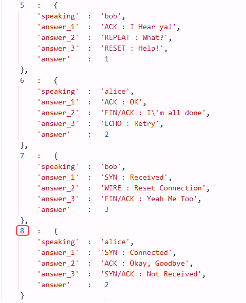
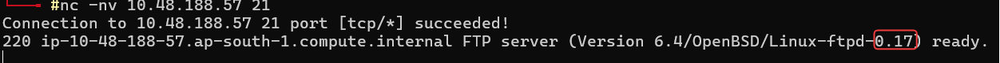

# Technical Learning Report: Active Reconnaissance

| Attribute            | Details                                        |
| :------------------- | :--------------------------------------------- |
| **Platform**         | TryHackMe                                      |
| **Course Path**      | Network Reconnaissance                         |
| **Topic**            | Active Reconnaissance                          |

---

## Executive Summary
This report documents the methodologies and findings associated with active reconnaissance, the process of directly interacting with target systems to verify operational status and service configurations. Unlike passive methods, active reconnaissance involves the transmission of packets directly to target infrastructure, providing high-fidelity data at the cost of increased detectability.

**Core Objectives Identified:**
1.  **Direct Surface Inspection:** Utilizing web browser developer tools to analyze client-side logic and hidden metadata.
2.  **Connectivity Verification:** Employing ICMP-based probes to determine host reachability and network characteristics.
3.  **Topology Mapping:** Analyzing the network path and intermediate routing infrastructure between the source and destination.
4.  **Service Identification:** Leveraging raw socket connections to perform banner grabbing and identify specific software versions.

---

## Technical Analysis

### 01. Web Interface Auditing
The web browser serves as a primary tool for initial active engagement. By utilizing Developer Tools, an investigator can move beyond the rendered content to inspect the underlying source code, network headers, and cookies. This phase often reveals developer comments, hidden API endpoints, or structural information about the application that is not immediately visible to a standard user.

### 02. Host Reachability (Ping)
The `ping` utility utilizes the Internet Control Message Protocol (ICMP) to verify if a remote host is active. Beyond basic reachability, the analysis of the Time to Live (TTL) values can provide significant clues regarding the target's operating system, while the Round Trip Time (RTT) indicates the proximity and stability of the network connection.

### 03. Path Discovery (Traceroute)
Traceroute identifies the geographical and logical path packets take across the internet. By intentionally manipulating the TTL field in the IP header, the tool forces each intermediate router to send a "Time Exceeded" message. This allows for the mapping of every hop in the infrastructure, identifying where latency occurs or where firewalls may be suppressing traffic.

### 04. Socket Interaction (Telnet and Netcat)
To identify the specific services running on open ports, raw socket tools like Telnet and Netcat are employed for "banner grabbing." When a connection is established to a service (such as a web or FTP server), the application often responds with a plaintext banner identifying its name and version. This information is critical for vulnerability research and identifying unpatched software.

---

## Task Completion and Evidence

### Task 1: Introduction
Active reconnaissance provides the ground truth of a system’s state, confirming the intelligence gathered during earlier passive phases.

### Task 2: Web Browser
Analyzing the structure and logic of a web application through integrated inspection tools.

*   **Findings:** Systematic inspection of the application source code revealed a total of 8 internal questions.

### Task 3: Ping
*   **Question:** Which option would you use to set the size of the data carried by the ICMP echo request?
*   **Answer:** -s
*   **Question:** What is the size of the ICMP header in bytes?
*   **Answer:** 8
*   **Question:** Does MS Windows Firewall block ping by default? (Y/N)
*   **Answer:** Y
*   **Practical Exercise:** Issuing 10 ICMP echo requests to the target IP.
*   **Result:** 10 successful replies received (0% packet loss).

### Task 4: Traceroute
*   **Question (Traceroute A):** Last router/hop IP before reaching destination?
*   **Answer:** 172.67.69.208
*   **Question (Traceroute B):** Last router/hop IP before reaching destination?
*   **Answer:** 104.26.11.229
*   **Question (Traceroute B):** Total intermediate routers between systems?
*   **Answer:** 26

### Task 5: Telnet
Manual banner grabbing to identify web server technology.
*   **Server Name:** Apache
*   **Server Version:** 2.4.61

### Task 6: Netcat
Establishing a raw TCP connection to verify service versions on legacy ports.

*   **Service Version Identified:** 0.17

---

## Final Conclusion
Active reconnaissance is an indispensable phase of technical investigation that converts theoretical surface maps into verified operational intelligence. While the browser and ping provide foundational reachability data, traceroute and netcat allow for deep infrastructure and service auditing. Success in this phase relies on the ability to interpret service banners and network signatures while remaining cognizant of the logs and alerts generated by direct interaction.