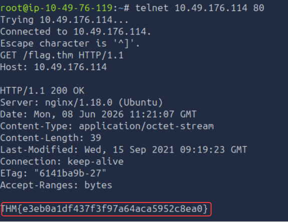
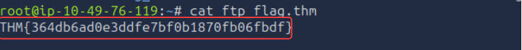
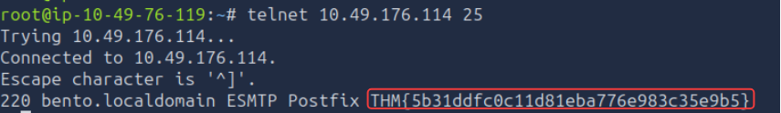
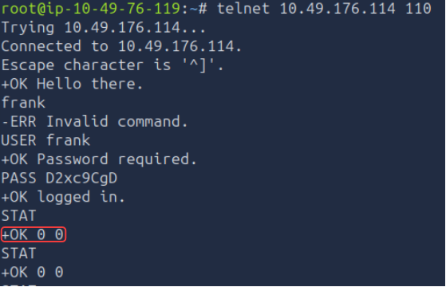

# Technical Learning Report: Protocols and Servers

| Attribute            | Details                                        |
| :------------------- | :--------------------------------------------- |
| **Platform**         | TryHackMe                                      |
| **Course Path**      |  Network Reconnaissance                        |
| **Topic**            | Protocols and Servers                          |

---

## Executive Summary
This report provides a detailed analysis of foundational application-layer protocols that facilitate web browsing, file transfers, and electronic mail. The investigation focuses on manual protocol interaction through raw socket connections to understand service behavior, header analysis, and the inherent security risks of cleartext communication.

**Core Objectives Identified:**
1.  **Manual Interrogation:** Using command-line tools to "speak" the native language of servers without a graphical interface.
2.  **Service Identification:** Utilizing port standards and service banners to identify server software and operating systems.
3.  **Data Persistence Models:** Distinguishing between different mail retrieval methodologies and file transfer modes.

---

## Technical Analysis

### 01. Remote Administration and Legacy Access (Telnet)
Telnet is an application-layer protocol used to provide a bidirectional interactive text-oriented communication facility using a virtual terminal connection.
*   **Mechanics:** It defaults to TCP port 23.
*   **Security Assessment:** All data, including authentication credentials, is transmitted in cleartext. While largely replaced by SSH for administration, the Telnet client remains a critical tool for testing other text-based protocols.

### 02. Web Content Delivery (HTTP)
The Hypertext Transfer Protocol (HTTP) serves as the foundation of data communication for the World Wide Web.
*   **Protocol Nature:** It is a stateless request-response protocol typically operating on port 80.
*   **Reconnaissance Value:** Server response headers often reveal specific software versions (e.g., Nginx or Apache) and the host operating system, providing essential data for vulnerability mapping.

### 03. Managed File Exchange (FTP)
File Transfer Protocol (FTP) is designed for efficient file movement between disparate systems.
*   **Dual-Channel Architecture:** FTP utilizes a control channel (Port 21) for commands and a separate data channel for the actual file stream.
*   **Operational Modes:** The protocol supports both Active and Passive modes to manage how data connections are established through firewalls.

### 04. Electronic Mail Infrastructure (SMTP, POP3, IMAP)
Email delivery and retrieval rely on a specialized triad of protocols:
*   **SMTP (Simple Mail Transfer Protocol):** Used for sending and relaying mail between servers, typically on port 25.
*   **POP3 (Post Office Protocol v3):** A "download and delete" model where mail is retrieved from the server and stored locally, typically on port 110.
*   **IMAP (Internet Message Access Protocol):** A synchronization model that keeps mail stored on the server for access across multiple devices, typically on port 143.

---

## Task Completion and Evidence

### Task 2: Telnet
*   **Question:** To which port will the telnet command with the default parameters try to connect?
*   **Answer:** 23

### Task 3: Hypertext Transfer Protocol (HTTP)
Manual retrieval of web resources using a Telnet client to simulate a browser request.

*   **Question:** Retrieve the file flag.thm from the target web server. What does it contain?
*   **Answer:** THM{e3eb0a1df437f3f97a64aca5952c8ea0}

### Task 4: File Transfer Protocol (FTP)
Establishing an authenticated session to recover protected data from a remote file server.

*   **Question:** Using an FTP client, recover the flag file from the server.
*   **Answer:** THM{364db6ad0e3ddfe7bf0b1870fb06fbdf}

### Task 5: Simple Mail Transfer Protocol (SMTP)
Connecting to the Mail Transfer Agent (MTA) to verify service availability and capture diagnostic flags.

*   **Question:** Connect to the SMTP port of the target VM. What is the flag?
*   **Answer:** THM{5b31ddfc0c11d81eba776e983c35e9b5}

### Task 6: Post Office Protocol 3 (POP3)
Interrogating the Mail Delivery Agent (MDA) to audit the mailbox status of a specific user.

*   **Question:** What is the response you get to the STAT command?
*   **Answer:** +OK 0 0
*   **Question:** How many email messages are available to download?
*   **Answer:** 0

### Task 7: Internet Message Access Protocol (IMAP)
*   **Question:** What is the default port used by IMAP?
*   **Answer:** 143

---

## Final Conclusion
Application protocols define the functional capabilities of a network. While these legacy protocols (HTTP, FTP, SMTP, POP3, IMAP) are efficient for data exchange, their reliance on cleartext transmission presents a systemic security risk. Modern security standards mandate the transition to encrypted variants (HTTPS, SFTP, SMTPS, IMAPS) to protect the confidentiality and integrity of the data stream.