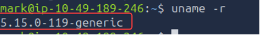
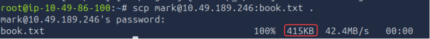
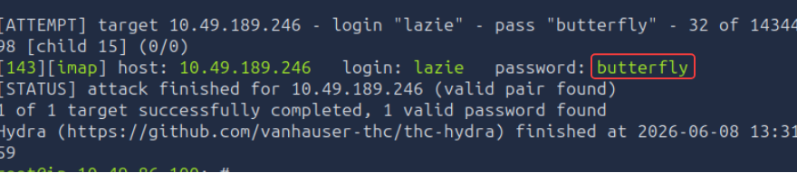

# Technical Learning Report: Protocols and Servers 2

| Attribute            | Details                                        |
| :------------------- | :--------------------------------------------- |
| **Platform**         | TryHackMe                                      |
| **Course Path**      | Network Reconnaissance                         |
| **Topic**            | Protocols and Servers 2                        |

---

## Executive Summary
This report analyzes the security landscape of network protocols, focusing on common attack vectors against cleartext communication and the implementation of cryptographic defenses. The study evaluates the transition from vulnerable legacy systems to modern, secure standards that ensure confidentiality and data integrity.

**Core Objectives Identified:**
1.  **Interception Mechanics:** Analyzing sniffing and Man-in-the-Middle (MITM) techniques used to capture and alter data.
2.  **Cryptographic Implementation:** Evaluating the role of Transport Layer Security (TLS) and Secure Shell (SSH) in armoring network traffic.
3.  **Authentication Security:** Investigating password-based vulnerabilities and automated credential exhaustion attacks.

---

## Technical Analysis

### 01. Network Interception and Traffic Analysis
Data transmitted via cleartext protocols (such as Telnet or legacy HTTP) is inherently vulnerable to observation and modification.
*   **Sniffing Attacks:** Utilizing packet capture tools like `tcpdump` or `Wireshark` to ingest raw traffic. If the protocol lacks encryption, sensitive data such as credentials can be extracted directly from the application layer payload.
*   **Man-in-the-Middle (MITM):** This involves actively redirecting traffic through an attacker-controlled node. Techniques such as ARP Spoofing allow an adversary to sit between a client and a server, providing the ability to not only read but also alter the data stream in real-time.

### 02. Secure Communication Standards (TLS and SSH)
To mitigate interception risks, encryption is applied to create a secure tunnel between endpoints.
*   **Transport Layer Security (TLS):** TLS wraps application protocols (becoming HTTPS, IMAPS, etc.) to provide mathematical proof of identity via certificates and to encrypt the data stream. Modern standards such as DNS over TLS (DoT) further enhance privacy by securing name resolution.
*   **Secure Shell (SSH):** Replacing Telnet for remote administration, SSH provides an encrypted channel for command-line access and file transfers. It utilizes host fingerprints to prevent MITM attacks and supports robust public-key authentication.

### 03. Credential Security and Exhaustion Attacks
Authentication serves as the primary gateway to network resources. When this gateway relies solely on "something you know" (passwords), it becomes a target for automated attacks.
*   **Attack Methodologies:** Tools like THC Hydra facilitate high-velocity attacks against services such as SSH, FTP, and IMAP. By iterating through wordlists of common or leaked passwords, an adversary can exploit human tendencies toward weak, predictable credentials.
*   **Defensive Measures:** Implementing Multi-Factor Authentication (MFA), account lockouts, and rate limiting are essential to neutralizing automated brute-force and dictionary attempts.

---

## Task Completion and Evidence

### Task 2: Sniffing Attack
*   **Question:** What do you need to add to the command `sudo tcpdump` to capture only Telnet traffic?
*   **Answer:** port 23
*   **Question:** What is the simplest display filter you can use with Wireshark to show only IMAP traffic?
*   **Answer:** imap

### Task 3: Man-in-the-Middle (MITM) Attack
*   **Question:** How many different interfaces does Ettercap offer?
*   **Answer:** 3
*   **Question:** In how many ways can you invoke Bettercap?
*   **Answer:** 3

### Task 4: Transport Layer Security (TLS)
*   **Question:** What is the three-letter acronym of the DNS protocol that uses TLS?
*   **Answer:** DoT

### Task 5: Secure Shell (SSH)
Establishing a secure remote session to perform system auditing and file transfers.

*   **Kernel Release Identified:** 5.15.0-119-generic

*   **SCP Transfer Size:** 415 KB

### Task 6: Password Attack
Utilizing automated password exhaustion to identify compromised credentials on an IMAP service.

*   **Target Account:** lazie
*   **Recovered Password:** butterfly

---

## Final Conclusion
The security of a network is determined by the strength of its protocol implementations and authentication policies. While cleartext protocols remain common in legacy and internal environments, they represent a significant risk of data disclosure and alteration. Transitioning to encrypted standards like TLS 1.3 and SSH, paired with rigorous password policies and multi-factor authentication, is the only effective method for maintaining sovereignty over network data.