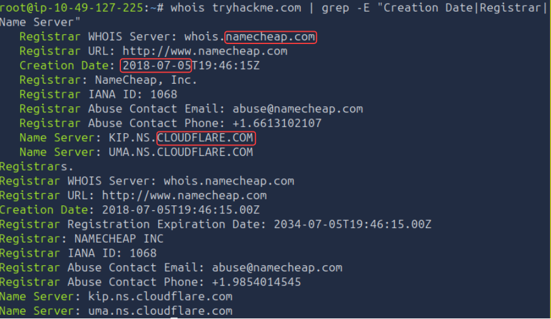
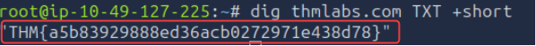
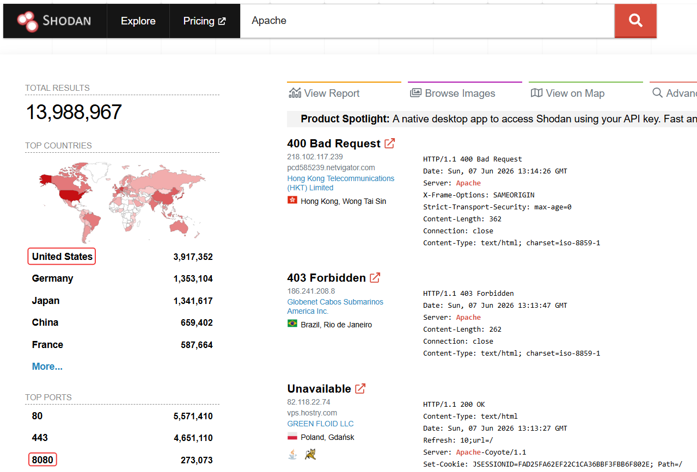
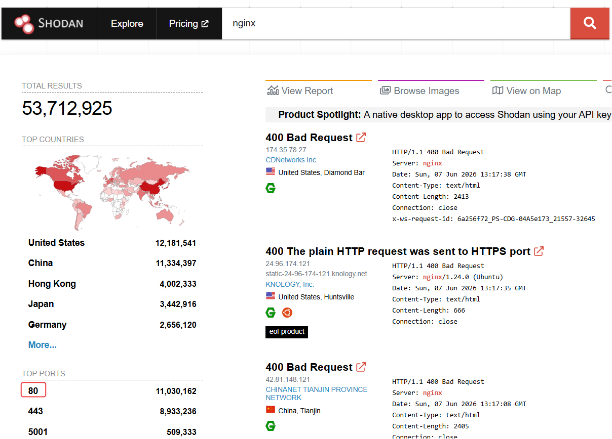

# Technical Learning Report: Passive Reconnaissance

| Attribute            | Details                                        |
| :------------------- | :--------------------------------------------- |
| **Platform**         | TryHackMe                                      |
| **Course Path**      | Network Reconnaissance                         |
| **Topic**            | Passive Reconnaissance                         |

---

## Executive Summary
This report details the methodologies and tools utilized in passive reconnaissance to gather intelligence on a target's digital footprint without direct interaction. The focus is on Open Source Intelligence (OSINT) gathering through public registries, DNS records, and internet-wide device scanners to map an attack surface while remaining undetected.

**Core Objectives Identified:**
1.  **Stealth Intelligence:** Differentiating between non-interactive (passive) and interactive (active) data collection.
2.  **Infrastructure Mapping:** Utilizing domain registration and DNS records to identify hosting providers and mail servers.
3.  **Discovery of Hidden Assets:** Leveraging certificate transparency logs and search engines to uncover subdomains and exposed services.

---

## Technical Analysis

### 01. Passive vs. Active Reconnaissance
The distinction between reconnaissance types is defined by the level of interaction with the target's infrastructure:
*   **Passive Reconnaissance:** Relying on third-party repositories. Queries are directed at public databases (e.g., social media, DNS resolvers, registrars) rather than the target's servers. This triggers no alerts on the target's internal monitoring systems.
*   **Active Reconnaissance:** Direct engagement. Any activity that involves sending packets to the target’s IP or interacting with their staff (social engineering) is classified as active. These actions are traceable and may be logged by Intrusion Detection Systems (IDS).

### 02. Registration Intelligence (WHOIS)
The WHOIS protocol provides a mechanism for querying databases that store the registered users or assignees of an internet resource. By analyzing WHOIS data, investigators can identify the registrar, the date of domain creation, and the authoritative name servers, which point toward the target's primary infrastructure providers.

### 03. DNS Enumeration and Subdomain Discovery
Domain Name System (DNS) records serve as the roadmap for a network. Using tools like `dig` or `nslookup` allows for the extraction of:
*   **A Records:** Mapping names to IPv4 addresses.
*   **MX Records:** Identifying mail servers.
*   **TXT Records:** Often containing security policies (SPF/DMARC) or verification strings.
*   **DNSDumpster & Certificate Transparency:** These tools aggregate data from public logs and caches to reveal subdomains that are not explicitly advertised, such as development or staging environments.

### 04. Device Census and Service Indexing (Shodan.io)
Shodan functions as a search engine for internet-connected devices. Unlike traditional search engines, Shodan indexes service banners rather than web content. This allows investigators to find specific versions of web servers (like Apache or nginx) and identify exposed ports across a global or organizational IP range without scanning the target directly.

---

## Task Completion and Evidence

### Task 1: Introduction
Passive reconnaissance serves as the lowest-risk phase of an engagement, providing high-value intelligence through publicly exposed data.

### Task 2: Passive Versus Active Recon
*   **Scenario 1:** Visiting a Facebook page to find employee names.
    *   **Activity Type:** P (Passive)
*   **Scenario 2:** Pinging the company webserver to check ICMP status.
    *   **Activity Type:** A (Active)
*   **Scenario 3:** Using social engineering on an IT administrator at a party.
    *   **Activity Type:** A (Active)

### Task 3: Whois
Analyzing domain registration metadata to establish infrastructure ownership.

*   **Question:** When was TryHackMe.com registered?
*   **Answer:** 20180705
*   **Question:** What is the registrar of TryHackMe.com?
*   **Answer:** namecheap.com
*   **Question:** Which company is TryHackMe.com using for name servers?
*   **Answer:** cloudflare.com

### Task 4: nslookup and dig
Utilizing DNS query tools to extract hidden verification strings.

*   **Question:** Check the TXT records of thmlabs.com. What is the flag there?
*   **Answer:** THM{a5b83929888ed36acb0272971e438d78}

### Task 5: DNSDumpster
*   **Question:** What is one interesting subdomain discovered on TryHackMe.com via DNSDumpster?
*   **Answer:** remote

### Task 6: Shodan.io
Analyzing the global distribution of web server technologies and their common port configurations.

*   **Question:** What is the first country in terms of publicly accessible Apache servers?
*   **Answer:** United States
*   **Question:** What is the 3rd most common port used for Apache?
*   **Answer:** 8080

*   **Question:** What is the most common port used for nginx?
*   **Answer:** 80

---

## Final Conclusion
Passive reconnaissance is a critical phase in security assessments. By aggregating data from diverse public sources such as WHOIS, DNS, and service crawlers like Shodan, an investigator can build a comprehensive map of a target's infrastructure. The primary advantage of this approach is the ability to maintain absolute stealth, ensuring that the target remains unaware of the investigation until a later, active phase begins.