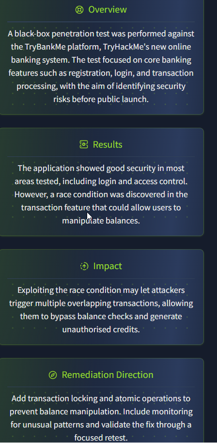
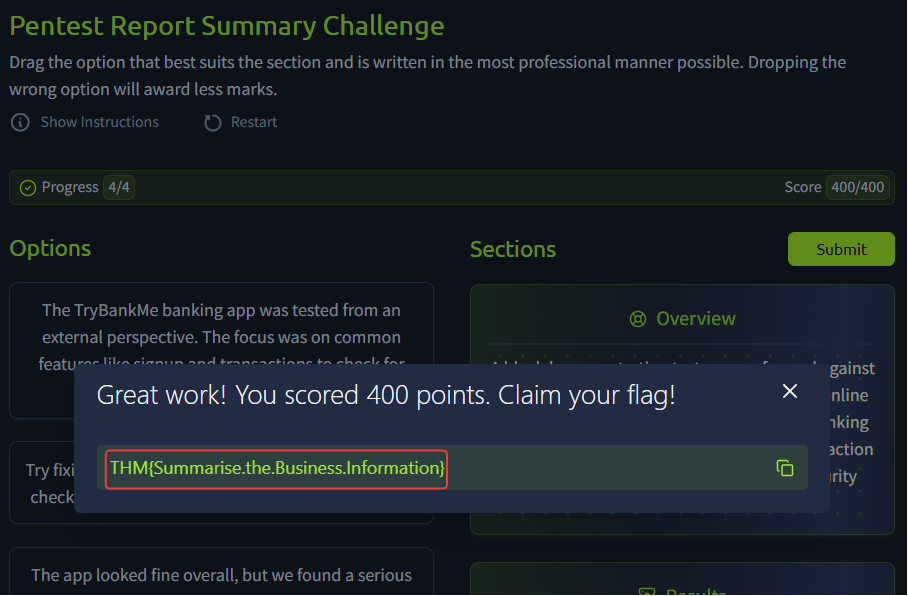
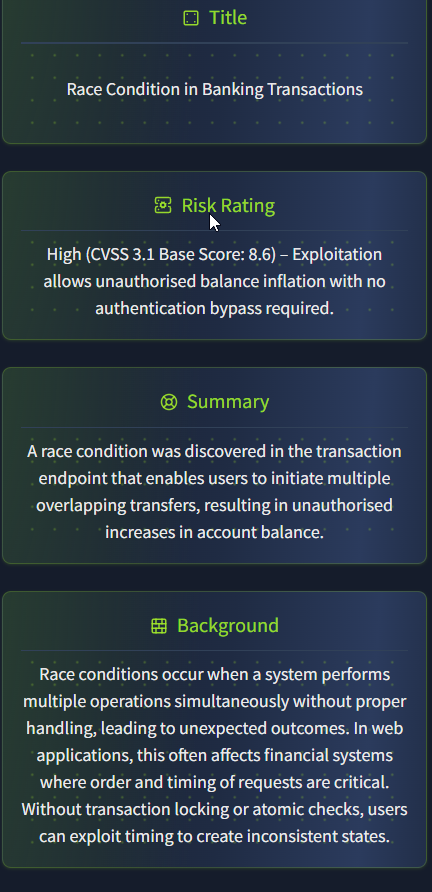
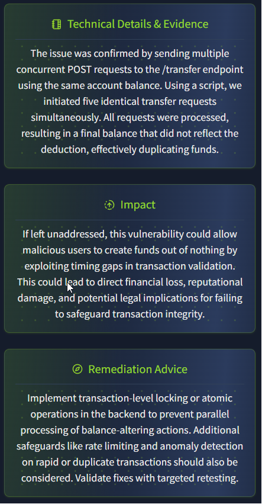
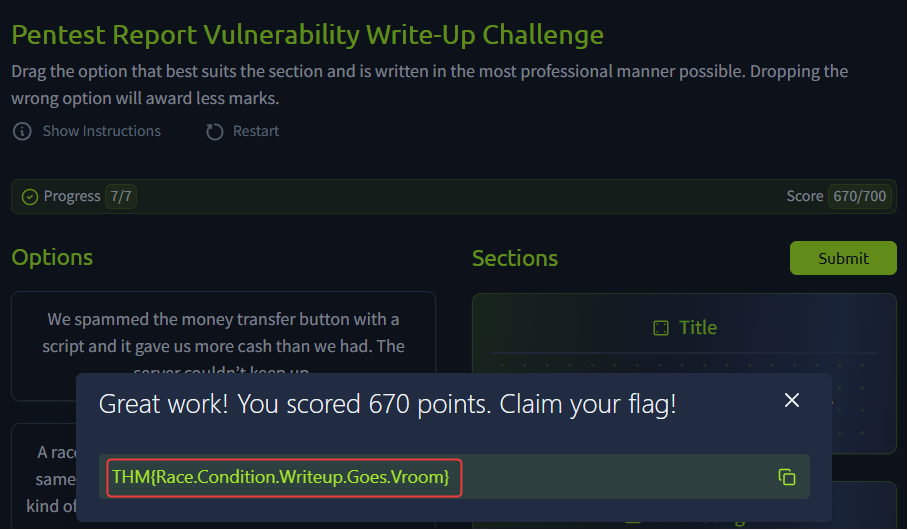
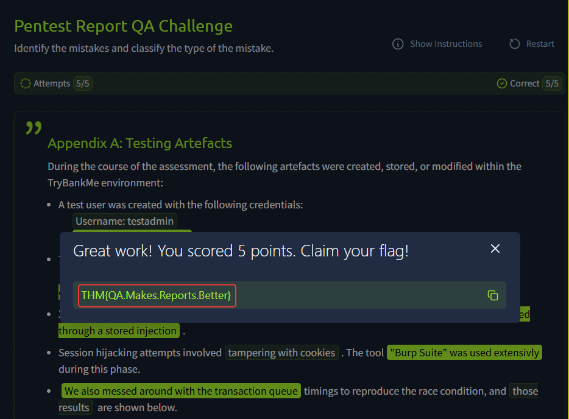

# Technical Learning Report: Professional Pentest Reporting

| Attribute            | Details                                        |
| :------------------- | :--------------------------------------------- |
| **Platform**         | TryHackMe                                      |
| **Course Path**      | Offensive Security                             |
| **Topic**            | Writing Pentest Reports                        |

---

## Executive Summary
This report deconstructs the methodology of professional security reporting, transitioning from raw technical discovery to an actionable "Forensic Decree." The focus is on bridging the communication gap between technical remediation teams and business stakeholders to ensure vulnerabilities are addressed based on calculated risk.

**Core Objectives Identified:**
1.  **Audience Segmentation:** Tailoring technical granularity to the stakeholder’s specific role (Technical, Security, or Business).
2.  **The Forensic Trinity:** Establishing a reporting law where every finding must consist of a verifiable fact, a visual anchor, and expert analysis.
3.  **Root Cause Remediation:** Shifting focus from symptomatic patches to addressing the underlying logic-core of a vulnerability.

---

## Technical Analysis

### 01. The Anatomy of a Pentest Report
A professional report is a multi-layered document designed for three distinct audiences:
*   **Technical Stakeholders (70-90% of content):** Developers and SysAdmins require root-cause analysis and technology-specific remediation steps to fix the vulnerabilities.
*   **Security Stakeholders (10-20% of content):** Security Managers use the report to prioritize attack chains and identify systemic process failures.
*   **Business Stakeholders (5-10% of content):** Executives require high-level abstraction focused on business impact, financial risk, and regulatory compliance.

### 02. Report Section 1: The Executive Summary
The summary is the most critical section for decision-makers. It must answer four primary questions:
1.  **Scope:** What was tested?
2.  **Results:** What was the overall security state?
3.  **Impact:** What is the real-world risk to the organization?
4.  **Direction:** What are the immediate high-level next steps?

### 03. Report Section 2: Vulnerability Write-Ups
Every finding follows the **Golden Thread**—a narrative flow that connects the technical bug to its business impact.
*   **Fact:** Direct evidence including HTTP requests, code snippets, or command output.
*   **Visual:** Forensic screenshots that verify the state of the system at the time of discovery.
*   **Analysis:** Expert context explaining why the vulnerability exists and how it affects this specific environment.

### 04. Report Section 3: Appendices and Quality Assurance
The appendix serves as the **Forensic Audit Trail**.
*   **Assessment Artefacts:** A comprehensive log of every file created, user added, or script uploaded. This is vital for the "Blue Team" to distinguish pentest activity from a genuine malicious attack.
*   **Quality Assurance (QA):** A mandatory filter to ensure the report remains objective, neutral, and free of sensitive data exposure (such as unmasked passwords).

---

## Task Completion and Evidence

### Task 1 & 2: Report Introduction and Anatomy
*   **Question:** Which stakeholder should 80% of your report be aimed towards?
*   **Answer:** Technical
*   **Question:** Which section of the report is for extra information that can help security stakeholders understand coverage?
*   **Answer:** Appendices

### Task 3: Report Section 1 - Summary
**Practical Exercise: Summary Construction**
Assembling a business-centric summary that communicates risk without technical jargon.

*   **Flag Captured:** `THM{Summarise.the.Business.Information}`

### Task 4: Report Section 2 - Vulnerability Write-Ups
**Practical Exercise: Documenting a Race Condition**
Applying the Forensic Trinity to a transaction logic vulnerability.

*   **Flag Captured:** `THM{Race.Condition.Writeup.Goes.Vroom}`

### Task 5: Report Section 3 - Appendices
*   **Question:** Which appendix will be vital for the blue team to discern if activity is from a pentest or an actual attack?
*   **Answer:** Assessment Artefacts

### Task 6: Styling Guides and Report QA
**Practical Exercise: Identifying Forensic Violations**
Quality Assurance audit to remove slang, first-person language, and sensitive credentials.

*   **Flag Captured:** `THM{QA.Makes.Reports.Better}`

---

## Final Conclusion
A pentest report is not merely a list of bugs; it is a professional decree that drives organizational change. By following the Forensic Trinity and the Golden Thread, a security professional ensures that findings are taken seriously, remediation is technically accurate, and the organizational risk is clearly understood by stakeholders at all levels.

---