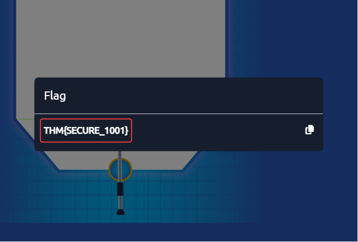

# Technical Learning Report: Governance and Regulation

| Attribute            | Details                                        |
| :------------------- | :--------------------------------------------- |
| **Platform**         | TryHackMe                                      |
| **Course Path**      | GRC                                            |
| **Topic**            | Governance & Regulation                        |

---

## Executive Summary
This report deconstructs the structural frameworks required to manage and regulate cyber security within an organization. It examines the integration of Governance, Risk Management, and Compliance (GRC) and evaluates international standards such as GDPR, NIST 800-53, and ISO 27001. The analysis highlights the transition from high-level legal mandates to granular technical procedures.

**Core Objectives Identified:**
1.  **Regulatory Alignment:** Distinguishing between internal governance and external regulatory enforcement.
2.  **Documentation Hierarchy:** Establishing the relationship between strategic policies and tactical procedures.
3.  **Risk Triage:** Utilizing GRC frameworks to prioritize organizational threats and implement auditable controls.

---

## Technical Analysis

### 01. Foundations of Governance and Regulation
The security posture of an organization is defined by the interaction between internal direction and external constraints:
*   **Governance:** The internal "will" of the organization. It involves strategic planning and directing resources to achieve business objectives while ensuring security.
*   **Regulation:** The external "mandate." These are rules enforced by governing bodies (e.g., EU for GDPR) to ensure data protection and prevent systemic harm.
*   **Compliance:** The state of successful adherence to both internal policies and external laws.

### 02. The Documentation Hierarchy
Information security frameworks rely on a structured document lifecycle to ensure that security goals are translated into actionable steps:
1.  **Policies:** High-level statements of intent (e.g., "We will protect user data").
2.  **Standards:** Mandatory requirements or specific technologies (e.g., "AES-256 encryption").
3.  **Procedures:** Step-by-step instructions for task execution.
4.  **Baselines:** The minimum required security level for any given system.
*   **Maintenance:** Documents must undergo a **Review and Update** cycle to remain effective against evolving threats.

### 03. GRC and Data Privacy
The **GRC (Governance, Risk Management, and Compliance)** framework serves as the engine for integrated security. It ensures that risk management is not a siloed activity but is instead aligned with legal obligations and business strategy.
*   **Risk Management:** The process of identifying and prioritizing threats to ensure limited resources are applied to the most critical vulnerabilities.
*   **Privacy Laws:** Regulations like **GDPR** (Data Privacy) and **PCI DSS** (Financial Data) impose strict penalties for negligence. GDPR Tier 1 violations can cost an organization up to 4% of its annual revenue.

---

## Task Completion and Evidence

### Task 2: Importance of Regulation
*   **Question:** A rule or law enforced by a governing body to ensure compliance and protect against harm is called?
*   **Answer:** Regulation
*   **Question:** Health Insurance Portability and Accountability Act (HIPAA) targets which domain for data protection?
*   **Answer:** Healthcare

### Task 3: Information Security Frameworks
*   **Question:** The step that involves monitoring compliance and adjusting the document based on feedback is called?
*   **Answer:** Review and update
*   **Question:** A set of specific steps for undertaking a particular task or process is called?
*   **Answer:** Procedure

### Task 4: Governance Risk and Compliance (GRC)
*   **Question:** What is the component in the GRC framework involved in identifying, assessing, and prioritising risks?
*   **Answer:** Risk Management
*   **Question:** Is it important to monitor and measure the performance of a developed policy?
*   **Answer:** yea

### Task 5: Privacy and Data Protection
*   **Question:** What is the maximum fine for Tier 1 users as per GDPR (in terms of percentage)?
*   **Answer:** 4
*   **Question:** In terms of PCI DSS, what does CHD stand for?
*   **Answer:** Cardholder Data

### Task 6: NIST Special Publications
*   **Question:** Per NIST 800-53, in which control category does the media protection lie?
*   **Answer:** Media Protection
*   **Question:** Per NIST 800-53, in which control category does the incident response lie?
*   **Answer:** Incident Response
*   **Question:** Which phase of NIST 800-53 compliance results in correlating identified assets and permissions?
*   **Answer:** Map

### Task 7: Management and Compliance
*   **Question:** Which ISO/IEC 27001 component involves selecting and implementing controls to reduce risks?
*   **Answer:** Risk treatment
*   **Question:** In SOC 2 generic controls, which control shows that the system remains available?
*   **Answer:** Availability

### Task 8: Interactive Exercise
**Practical Exercise: GRC Strategy Implementation**
Completing the GRC organizational simulation to align policy, risk assessment, and compliance.

*   **Flag Captured:** THM{GRC_MATURITY}

---

## Final Conclusion
Cyber security governance is a continuous lifecycle rather than a static state. By mapping technical controls (NIST) to management systems (ISO 27001) and validating them through independent audits (SOC 2), an organization can demonstrate "Due Diligence." The ultimate defense against regulatory penalties and data breaches is a mature GRC engine that prioritizes risk over mere administrative checkboxes.