# Technical Learning Report: OWASP Top 10 2025 - Application Design Flaws

| Attribute            | Details                                               |
| :------------------- | :---------------------------------------------------- |
| **Platform**         | TryHackMe                                             |
| **Course Path**      | OWASP Top 10 2025                                     |
| **Topic**            | Application Design Flaws (AS02, AS03, AS04, AS06)     |

---

## Executive Summary

This report provides a analysis of four critical security categories defined in the OWASP Top 10 2025 update. Unlike code-level bugs, these vulnerabilities stem from architectural failures, insecure defaults, and flawed logic. By examining misconfigurations, supply chain dependencies, cryptographic weaknesses, and insecure designs, this report establishes that a system's security is entirely dependent on the strength of its foundational blueprint.

**Core Objectives Analyzed:**
1.  **Environmental Hardening (AS02):** Mitigating the risk of verbose error reporting and exposed administrative traces.
2.  **Dependency Integrity (AS03):** Identifying the systemic risks of utilizing unverified or outdated third-party libraries.
3.  **Cryptographic Sovereignty (AS04):** Eliminating hardcoded keys and moving toward secure key management lifecycle.
4.  **Architectural Logic (AS06):** Correcting flawed assumptions regarding client-side trust boundaries.

---

## Technical Analysis

### AS02: Security Misconfigurations
Security misconfigurations occur when environments are deployed with unsafe defaults or incomplete hardening. A common failure point is the exposure of administrative "traces" or debugging endpoints within User Management APIs. Verbose error messages that echo internal system details provide attackers with a roadmap of the backend structure.

### AS03: Software Supply Chain Failures
Modern applications function as a collection of third-party dependencies. If an application imports an outdated library, it inherits every vulnerability within that component. Supply chain failures often manifest as unverified "utility" scripts that contain debugging hooks or insecure processing logic that can be subverted to bypass security controls.

### AS04: Cryptographic Failures
Cryptographic failure is rarely a failure of the mathematics itself, but rather a failure of key management. Storing encryption keys within client-side JavaScript or using deprecated modes like AES-ECB (Electronic Code Book) allows attackers to decrypt sensitive data once the hardcoded secret is discovered in the frontend source code.

### AS06: Insecure Design
Insecure design represents a fundamental failure in threat modeling. Developers often assume that restricting a frontend to specific device types (via User-Agent checks) constitutes a security boundary. However, if the backend APIs remain unauthenticated and accessible, the entire design premise collapses as soon as the client-side metadata is spoofed.

---

## Task Completion and Evidence

### Task 2: AS02: Security Misconfigurations
*   **Question:** What is the flag?
*   **Answer:** THM{V3RB0S3_3RR0R_L34K}

**Analysis:**
Initial reconnaissance identified a predictable API structure. By passing out-of-bounds parameters such as a negative integer, the system triggered a verbose error leak.

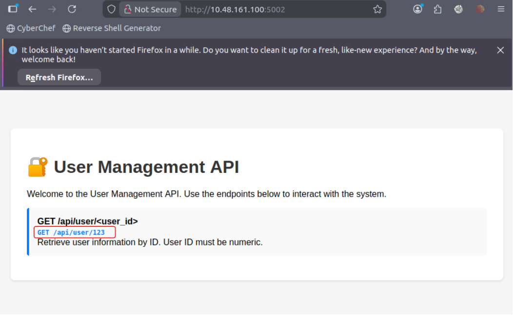

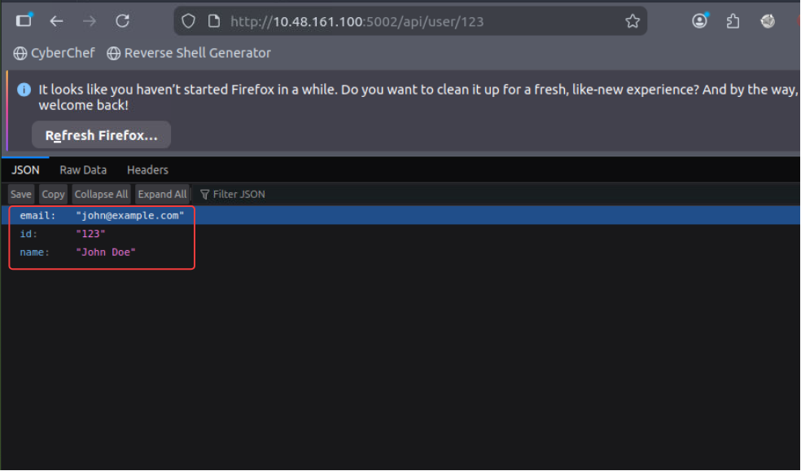

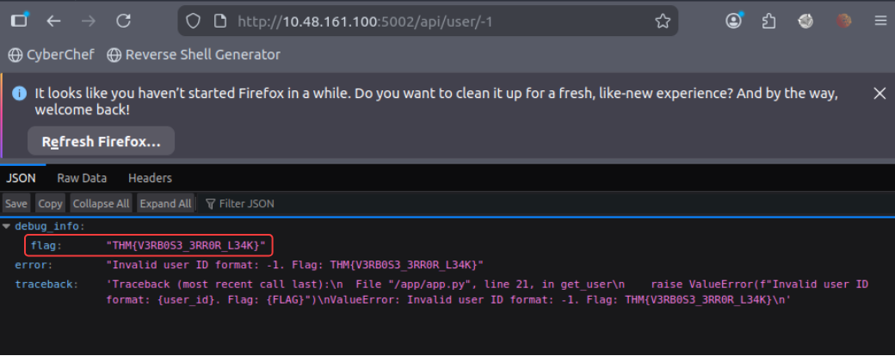

### Task 3: AS03: Software Supply Chain Failures
*   **Question:** What is the flag?
*   **Answer:** THM{SUPPLY_CH41N_VULN3R4B1L1TY}

**Analysis:**
The application relied on an outdated internal library. Analysis of the utility's processing logic revealed that providing a specific "debug" keyword bypassed standard string transformations to reveal the flag using Burp Repeater.

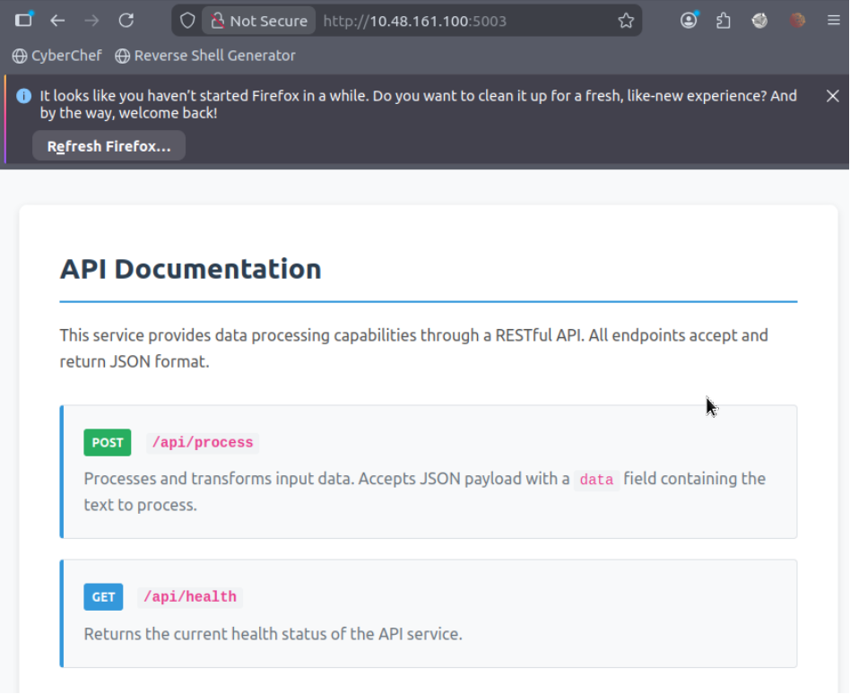

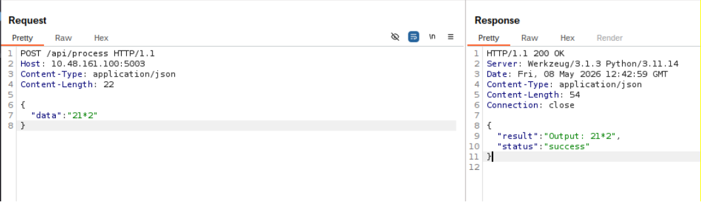

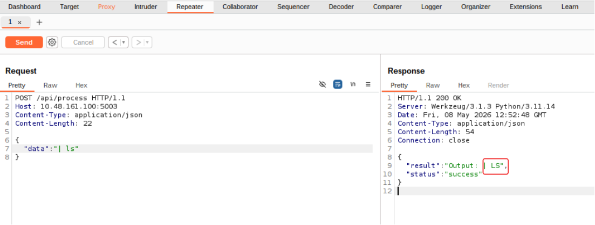

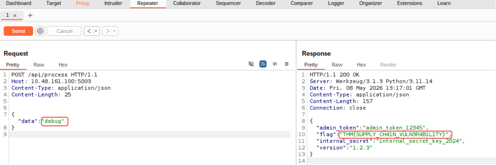

### Task 4: AS04: Cryptographic Failures
*   **Question:** What is the flag?
*   **Answer:** THM{CRYPTO_FAILURE_H4RDCOD3D_K3Y}
  
**Analysis:**
An encrypted document was found on the server. Examination of the frontend source revealed a hardcoded 128-bit AES key and the use of ECB mode. The document was successfully decrypted using CyberChef.

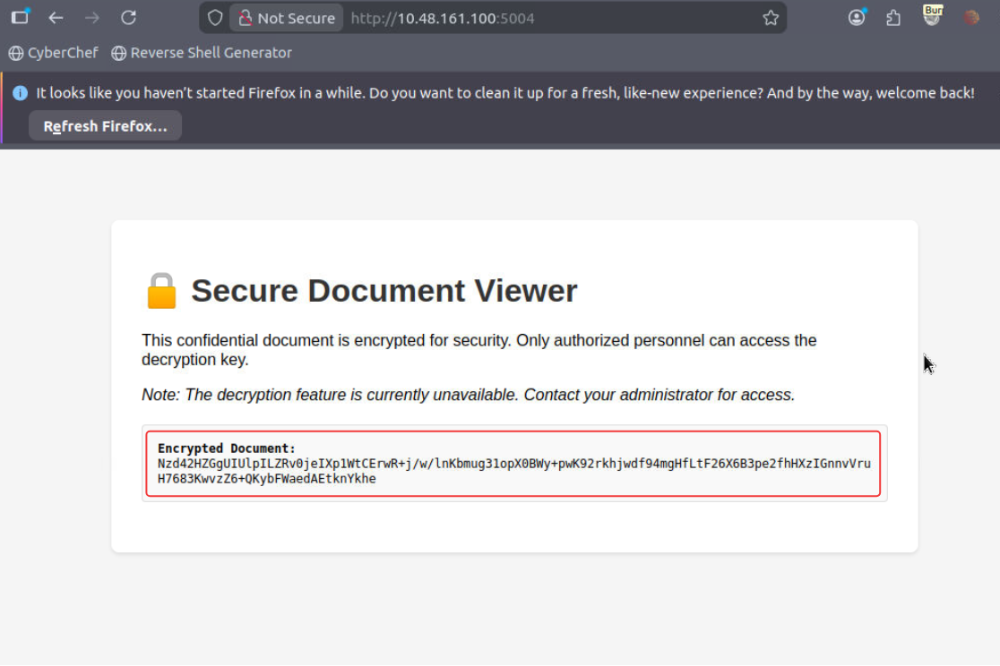

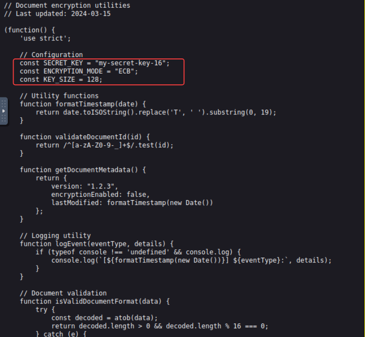

Using online tool: https://gchq.github.io/CyberChef/

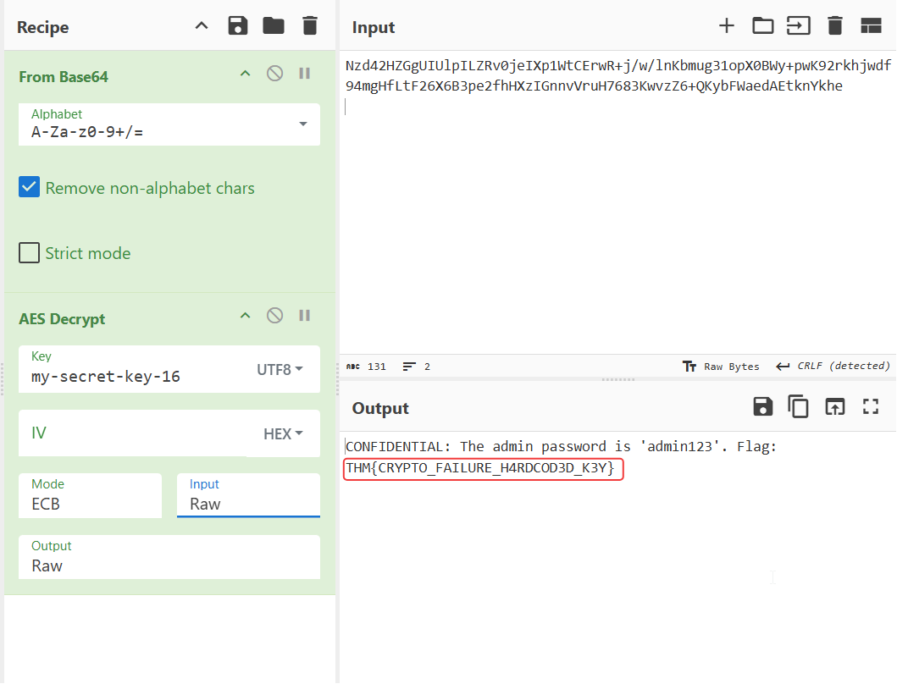

### Task 5: AS06: Insecure Design
*   **Question:** What is the flag?
*   **Answer:** THM{1NS3CUR3_D35IGN_4SSUMPT10N}
   
**Analysis:**
Access was initially restricted to mobile devices. By spoofing the User-Agent to simulate an iPhone, the frontend was bypassed. Further analysis showed the backend API for administrative messages was completely unauthenticated.
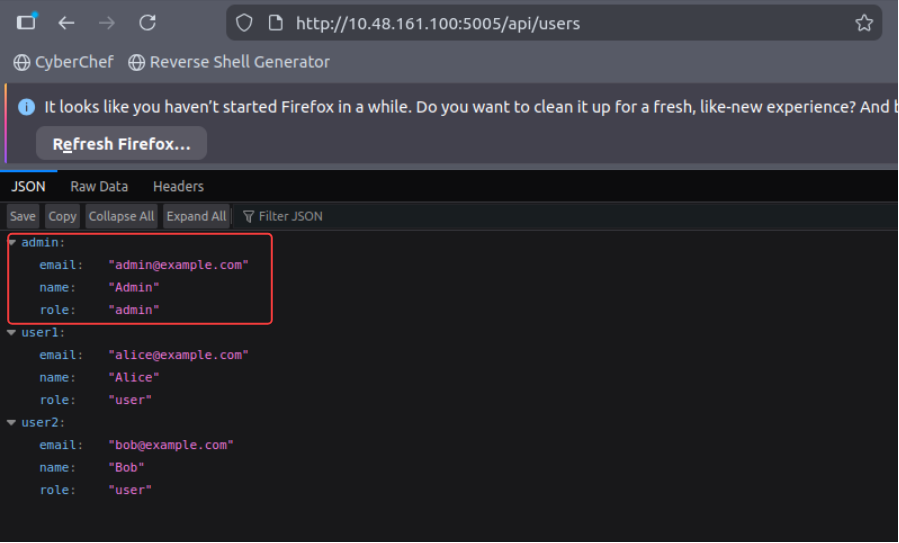
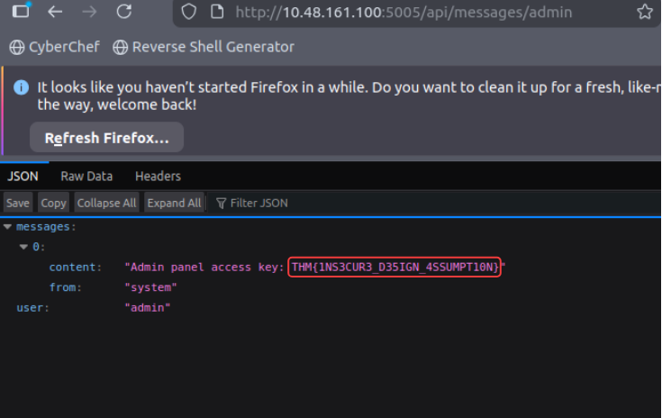

---

## Final Conclusion

The security of an application is defined at the design phase. As demonstrated across these four categories, technical implementations are easily subverted when the underlying architecture is flawed. To maintain a resilient posture, developers must suppress verbose environment feedback, verify the provenance of all dependencies, isolate cryptographic secrets from the frontend, and ensure that backend APIs never trust client-side metadata for access control decisions.