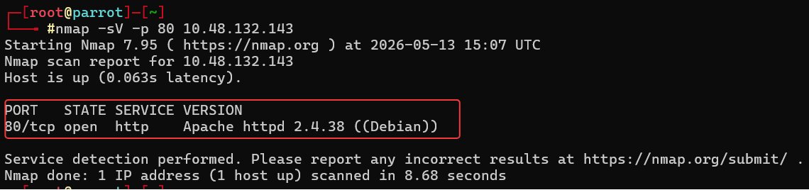
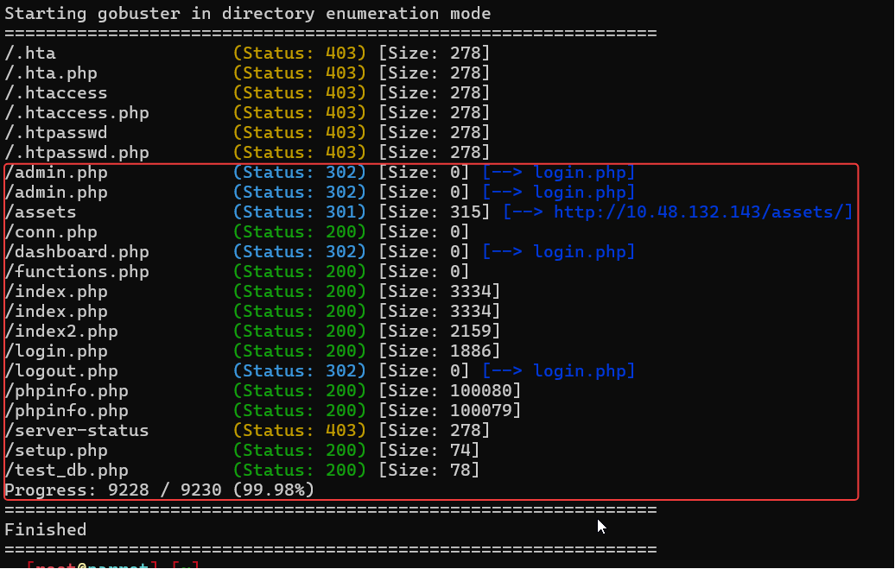
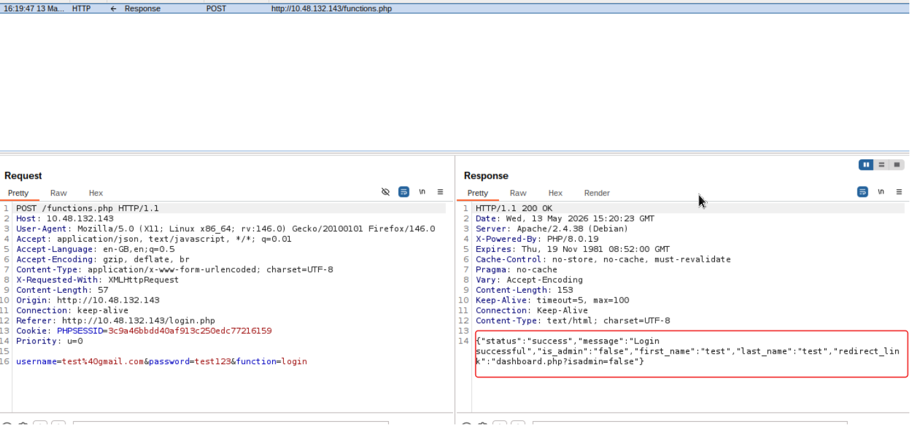
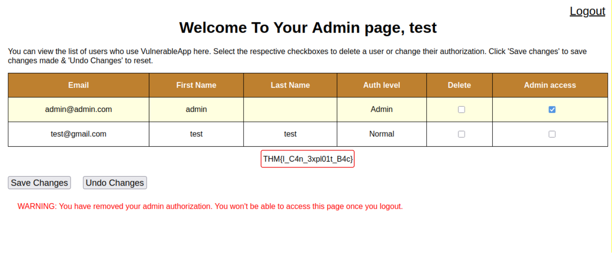

# Technical Learning Report: Broken Access Control

| Attribute            | Details                                        |
| :------------------- | :--------------------------------------------- |
| **Platform**         | TryHackMe                                      |
| **Topic**            | Broken Access Control                          |

---

## Executive Summary
This report deconstructs the mechanics of Broken Access Control, identified as the primary risk in the OWASP Top 10. The analysis explores the systemic failure of applications to properly enforce restrictions on user access, leading to unauthorized data exposure and functional elevation. The study culminates in the successful execution of a vertical privilege escalation attack against a vulnerable PHP-based web architecture.

**Core Objectives Identified:**
1.  **Access Control Modeling:** Differentiating between discretionary, mandatory, role-based, and attribute-based enforcement.
2.  **Authorization Logic Gaps:** Identifying how client-side parameter trust leads to vertical and horizontal escalation.
3.  **Forensic Mitigation:** Implementing server-side session management and role-based validation to neutralize logic-based breaches.

---

## Technical Analysis

### 01. Theoretical Framework of Access Control
Access control is the security infrastructure that regulates which users can interact with specific resources. This study classifies four primary models:
*   **Role-Based Access Control (RBAC):** Access is granted based on defined organizational roles (e.g., Manager, Employee).
*   **Attribute-Based Access Control (ABAC):** Access is determined by environmental or user attributes (e.g., time of day, department, device type).
*   **Discretionary Access Control (DAC):** Resource owners set permissions at their own discretion.
*   **Mandatory Access Control (MAC):** The system enforces non-negotiable security clearances and labels.

### 02. Access Control Failures
When these models are improperly implemented, two primary escalation vectors emerge:
*   **Horizontal Privilege Escalation:** An attacker accesses resources belonging to a peer with the same privilege level (e.g., User A viewing User B's private files).
*   **Vertical Privilege Escalation:** An attacker bypasses restrictions to gain the functionality of a higher-privileged user (e.g., a standard user accessing administrative tools).

### 03. Vulnerability Discovery and Assessment
The assessment phase utilizes reconnaissance tools to map the hidden attack surface.
*   **Service Fingerprinting:** Identifying the backend stack (Apache/PHP) to understand the likely environment for session handling.
*   **Endpoint Discovery:** Using directory brute-forcing to locate administrative and registration pages that are not linked in the primary user interface.
*   **Logic Interception:** Utilizing proxy tools to analyze the data exchange during the authentication handshake.

---

## Task Completion and Evidence

### Task 1 & 2: Foundations
*   **Question:** What is IDOR?
*   **Answer:** Insecure direct object reference
*   **Question:** What occurs when an attacker can access resources belonging to other users with the same level of access?
*   **Answer:** Horizontal privilege escalation
*   **Question:** What occurs when an attacker can access data from users with higher access levels?
*   **Answer:** Vertical privilege escalation
*   **Question:** What is ABAC?
*   **Answer:** Attribute-Based Access Control
*   **Question:** What is RBAC?
*   **Answer:** Role-Based Access Control

### Task 3 & 4: Assessing the Web Application
*   **Question:** What is the type of server that is hosting the web application?
*   **Answer:** Apache
*   **Question:** What is the name of the parameter in the JSON response from the login request that contains a redirect link?
*   **Answer:** redirect_link
*   **Question:** What Burp Suite module allows us to capture requests and responses?
*   **Answer:** Proxy
*   **Question:** What is the admin’s email that can be found in the online users’ table?
*   **Answer:** admin@admin.com

---

### Task 5: Exploiting the Web Application

**Reconnaissance and Discovery**
The initial scan identified an Apache/2.4.38 server. Directory brute-forcing revealed critical endpoints including `login.php`, `registration.php`, and `admin.php`.

**Logic Interception and Parameter Manipulation**
Upon logging into a newly created account, Burp Suite was used to intercept the server's response. The server returned a JSON object leaking a sensitive authorization parameter: `isadmin=false`.

**Vertical Escalation and Flag Capture**
By manually injecting the `?isadmin=true` parameter into the browser's address bar at the `dashboard.php` endpoint, the application's client-side logic was bypassed. This granted access to the hidden administrative panel, allowing for the exfiltration of the system flag.

*   **Question:** What kind of privilege escalation happened after accessing admin.php?
*   **Answer:** Vertical
*   **Question:** What parameter allows the attacker to access the admin page?
*   **Answer:** isadmin
*   **Question:** What is the flag in the admin page?
*   **Answer:** THM{I_C4n_3xpl01t_B4c}

---

## Final Conclusion and Mitigation
The breach was made possible by the application's reliance on client-side parameters to define administrative status. To secure the system, the following mitigations are required:

1.  **Server-Side Sovereignty:** Authorization checks must occur on the server. The application should query a database to verify a user's role and store that role in a secure, server-side session variable (`$_SESSION['is_admin']`) that the client cannot modify.
2.  **Implementation of RBAC:** Moving away from binary flags (`isadmin=true`) to a robust Role-Based Access Control matrix ensures more granular and secure permission handling.
3.  **Removal of Logic Leaks:** Sensitive redirect parameters and authorization statuses should never be exposed in JSON responses or URL strings.

---
