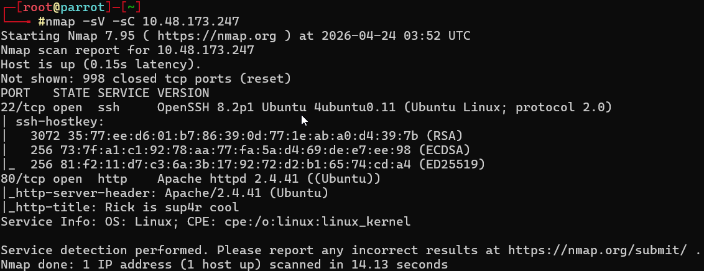
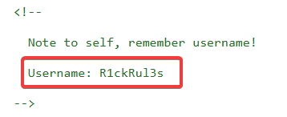
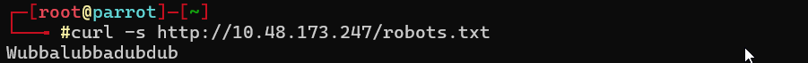
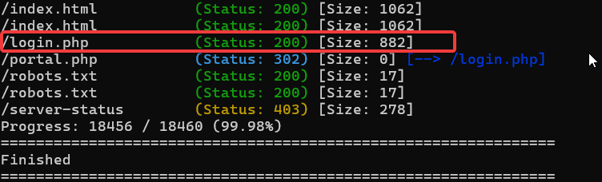
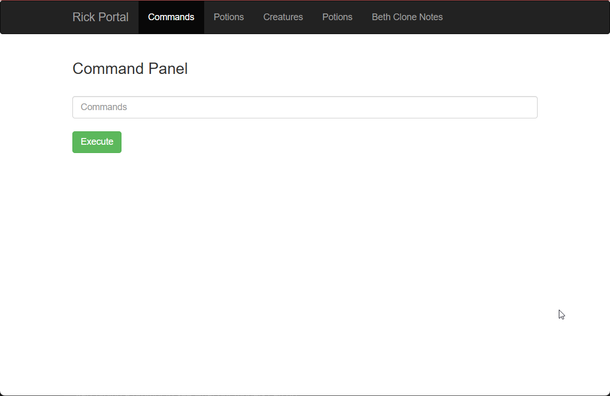
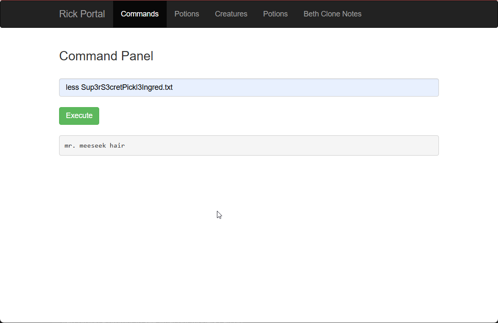
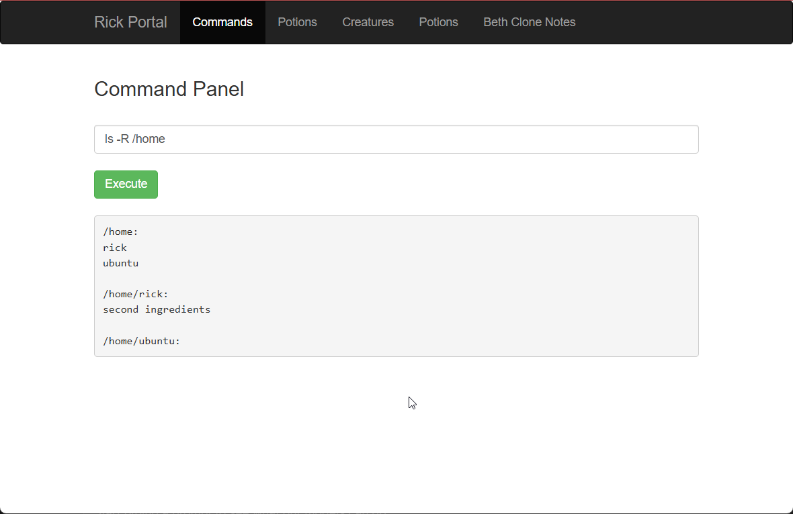
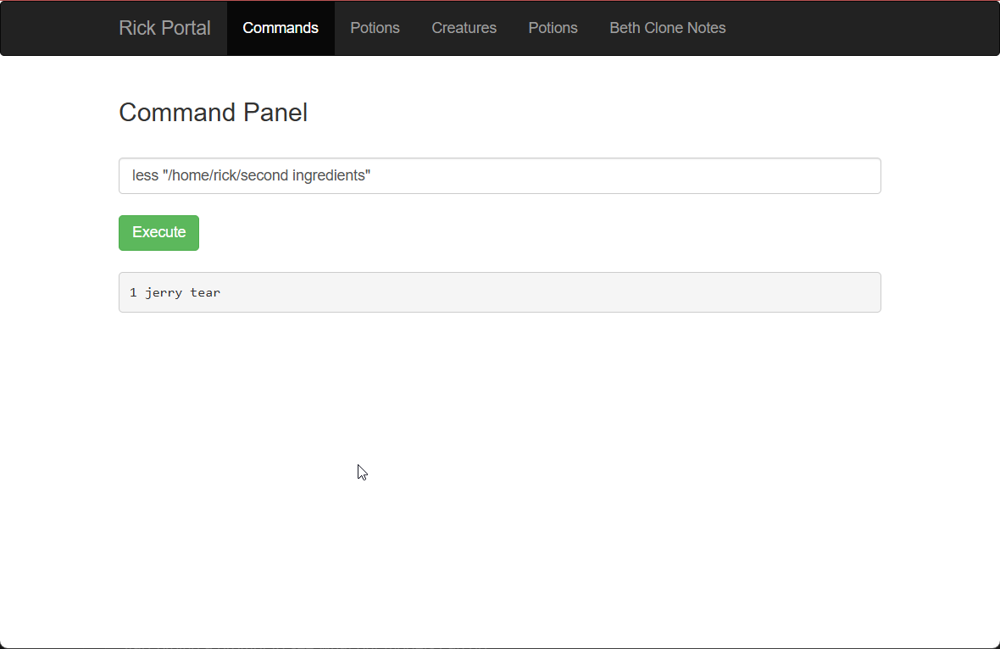
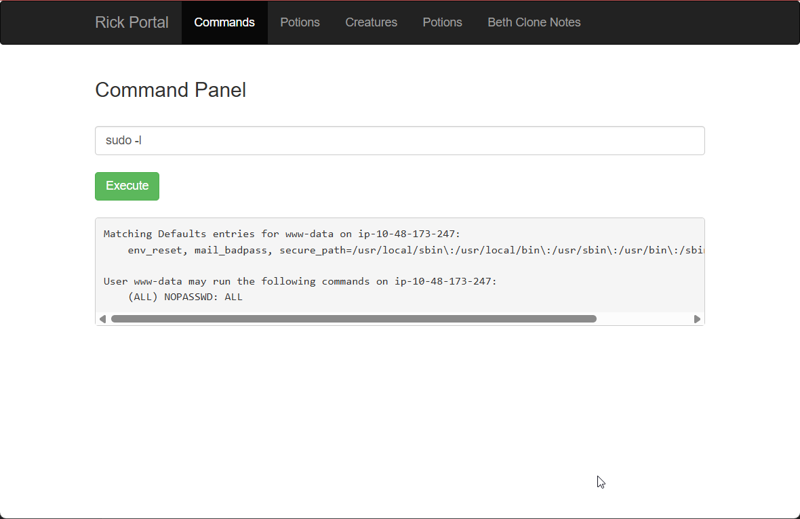
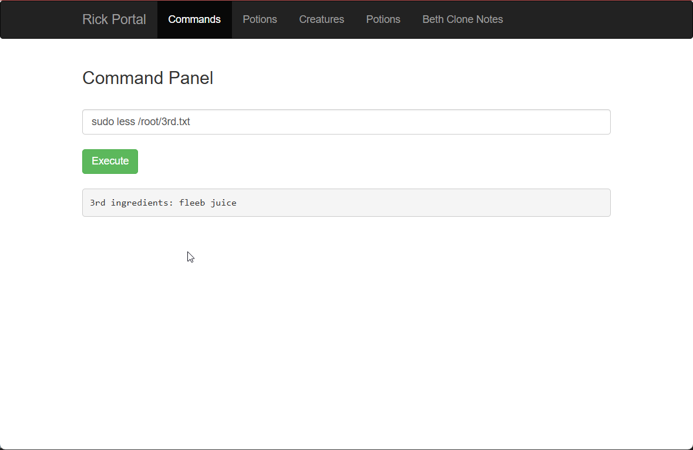

# **Forensic Security Assessment: Pickle Rick**

| Attribute            | Details                                        |
| :------------------- | :--------------------------------------------- |
| **Platform**         | TryHackMe                                      |
| **Room Name**        | Pickle Rick                                    |
| **Target IP**        | 10.48.173.247                                  |
| **Difficulty Level** | Easy                                           |
| **Status**           | **Complete System Compromise (Root achieved)** |

---

## **Executive Summary**

The security assessment of the "Pickle Rick" infrastructure revealed critical systemic failures in both the web application layer and the underlying operating system configuration. The environment was fully compromised within a single engagement window.

**Primary Findings:**

1.  **Credential Leak:** Administrative credentials were discovered in plaintext within public metadata.
2.  **Unrestricted Command Execution:** An authenticated portal allowed for direct OS command injection.
3.  **Privilege Escalation:** The web user (`www-data`) possessed unrestricted `sudo` privileges without password requirements.

**Strategic Impact:** An attacker can move from zero-knowledge reconnaissance to full **Root Sovereignty** , resulting in a total loss of data confidentiality, integrity, and availability.

---

## **Technical Analysis & Kill-Chain**

### **01. Reconnaissance & Service Discovery**

 An initial Nmap service scan of `10.48.173.247` identified two active TCP services:

- **Port 22:** OpenSSH 8.2p1 (Ubuntu)
- **Port 80:** Apache httpd 2.4.41 (Ubuntu)



**Analysis:** The presence of a web server titled "Rick is sup4r cool" indicates non-standard application headers, a custom-built application. While SSH is open, the versioning information is exposed, providing a starting point for vulnerability mapping.

**Remediation:** Disable service banners in `ssh_config` and `apache2.conf`. Mask version numbers to increase the "reconnaissance overhead" for an attacker.

---

### **02. Credential Leakage via Metadata**

 Manual inspection of the application source code and standard metadata files revealed administrative credentials:

- **Username:** `R1ckRul3s` (Found in HTML comments at `/index.html`)
- **Password:** `Wubbalubbadubdub` (Found in `/robots.txt`)




**Analysis:** Metadata containers like `robots.txt` and HTML comments were mutilized for cleartext credential storage.

**Remediation:** Remove all sensitive comments from production code. Implement a robust secrets management policy. Credentials must never be stored in plain text within the web root.

---

### **03. Directory Discovery & Authentication**

 Automated directory enumeration using `Gobuster` identified a hidden administrative gateway.

```bash
gobuster dir -u http://10.48.173.247 -w /usr/share/wordlists/dirb/common.txt -x php,txt,html
```



**Analysis:** The discovery of `login.php` coupled with the previously leaked credentials provided the attacker with an authenticated session on the administrative "Command Panel."

---

### **04. Remote Code Execution (RCE) & Filter Bypass**

 The `portal.php` interface allowed for direct OS command execution. While the `cat` command was blacklisted, the  blacklist was bypassed using the `less` utility.



**Analysis:** The application uses a flawed **"Blacklist" Invariant**. By blocking only specific strings (like `cat`), the developer failed to account for synonymous binaries (`less`, `more`, `tail`) that perform the same action.

**Ingredient Captured:** `mr. meeseek hair`



**Remediation:** Delete the command panel. If shell interaction is required, implement a strict **Whitelist** of allowed inputs and use secure APIs instead of raw shell execution.

---

### **05. Lateral Movement & Filesystem Enumeration**

 Using the RCE primitive, a recursive scan of the `/home` directory was performed, identifying the second ingredient in the `/home/rick` directory.

<div class="tight-fit">



</div>

**Ingredient Captured:** `1 jerry tear`



**Analysis:** Excessive directory permissions (`rx` for others) allowed the `www-data` user to explore the private home folders of other users.

**Remediation:** Implement restrictive ACLs on all home directories (`chmod 700`).

---

### **06. Full Privilege Escalation (Sudoers)**

 An audit of the current user's privileges via `sudo -l` revealed that `www-data` could run **ALL** commands as **ROOT** without a password.



**Analysis:** This is the **critical vulnerability.** of the system. Granting a web-facing service account (`www-data`) unrestricted `sudo` access is a pathway to full system compromise.

**Final Ingredient Captured:** `fleeb juice`

<div class="tight-fit">



</div>

**Remediation:** Audit `/etc/sudoers` immediately. The `www-data` user should have **ZERO** sudo privileges. Use the Principle of Least Privilege (PoLP).

---

## **Final Results**

| Objective             | Finding            |
| :-------------------- | :----------------- |
| **First Ingredient**  | `mr. meeseek hair` |
| **Second Ingredient** | `1 jerry tear`     |
| **Third Ingredient**  | `fleeb juice`      |

**Conclusion:**
The system relied on "Security through Obscurity" (hidden files), which failed against standard enumeration. The ultimate breach was caused by a combination of **Insecure Credential Storage** and **Over-privileged Service Accounts**.
