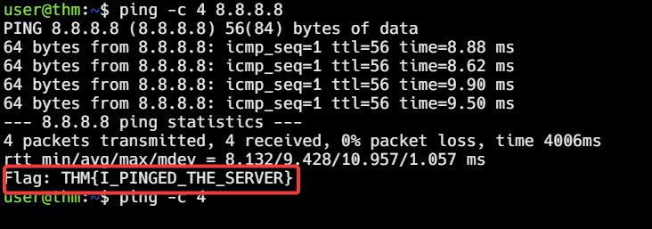

This is a professional, clean format optimized for technical documentation and public uploads. All Tarka-specific notation and symbolic operators have been removed and replaced with standard English descriptive logic and professional grammar.

***

# Technical Learning Report: Introduction to Networking

| Attribute            | Details                                        |
| :------------------- | :--------------------------------------------- |
| **Platform**         | TryHackMe                                      |
| **Course Path**      | Pre-Security / Network Fundamentals            |
| **Topic**            | Introduction to Networking                     |

---

## Executive Summary
This report examines the fundamental mechanics of node connectivity and identity within a digital network. The analysis explores the transition from general network definitions to specific identification standards and verification protocols that govern modern communication.

**Core Objectives Identified:**
1.  **Identity Duality:** Analyzing the separation of logical addressing and physical hardware identification.
2.  **Trust Boundaries:** Distinguishing between restricted private networks and universal public subnets.
3.  **Operational Verification:** Utilizing diagnostic pulses to detect node states and perform reconnaissance.

---

## Technical Analysis

### 01. The Foundation of Networking and the Internet
A network facilitates data exchange by connecting different hardware components for the purpose of resource sharing. It is categorized into two primary types:
*   **Private Network:** Provides restricted access to local nodes and is utilized for secure internal data sharing.
*   **Public Network:** Provides a universal subnet, commonly known as the Internet.

The Internet is defined as the total sum of all private networks and their public interconnects. It functions as a network of networks, evolving from the historical ARPANET foundation of the 1960s into the modern World Wide Web established in 1989.

---

### 02. Device Identification Standards

#### IP Address (Internet Protocol)
The IP Address serves as a logical network label for a device. It is structured in octets and is dynamic in nature. 
*   **Public IP Address:** This address is unique to the global grid.
*   **Private IP Address:** This address is unique only within the local network boundary.
*   **Key Principle:** IP addresses represent where a device currently resides on the logical map. Because they are permeable, they can be modified or spoofed.

#### MAC Address (Media Access Control)
The MAC Address is a physical hardware identifier. It acts as a permanent serial number etched into the device at the factory.
*   **Function:** It is primarily used for physical layer filtering and trust-based verification.
*   **Key Principle:** Unlike the logical IP name, the MAC address serves as a digital fingerprint for the physical hardware.

---

### 03. Diagnostic Verification (ICMP and Ping)
The Internet Control Message Protocol is a diagnostic, echo-based system used for node discovery and network performance measurement.
*   **The Process:** A source sends an Echo Request to a target, and the target responds with an Echo Reply.
*   **Analysis:** This process functions as the heartbeat of the network. It measures latency and confirms whether a remote node is active. In a security context, this is a primary tool for initial reconnaissance.

---

## Task Completion and Evidence

### Task 1: What is Networking?
*   **Question:** What is the key term for devices that are connected together?
*   **Answer:** Network

### Task 2: What is the Internet?
*   **Question:** Who is the inventor of the World Wide Web?
*   **Answer:** Tim Berners-Lee

### Task 3: Identifying Devices on a Network
*   **Question:** What does the term IP stand for?
*   **Answer:** Internet Protocol
*   **Question:** What is each section of an IP address called?
*   **Answer:** Octet
*   **Question:** How many sections (in digits) does an IPv4 address have?
*   **Answer:** 4
*   **Question:** What does the term MAC stand for?
*   **Answer:** Media Access Control

**Practical Exercise: MAC Spoofing**
Bypassing a restricted gateway by assuming the physical identity of an authorized node.

*   **Flag Captured:** THM{YOU_GOT_ON_TRYHACKME}

### Task 4: Ping (ICMP)
*   **Question:** What protocol does ping use?
*   **Answer:** ICMP
*   **Question:** What is the syntax to ping 10.10.10.10?
*   **Answer:** ping 10.10.10.10

**Practical Exercise: ICMP Verification**
Measuring connectivity and reachability to a global DNS resolver.

*   **Flag Captured:** THM{I_PINGED_THE_SERVER}

---

## Final Conclusion
Identity on a network is a dual construct. The IP address defines the logical route, while the MAC address identifies the physical body. A significant security risk occurs when a system trusts the metadata of an identity without performing a verified operational pulse check.

