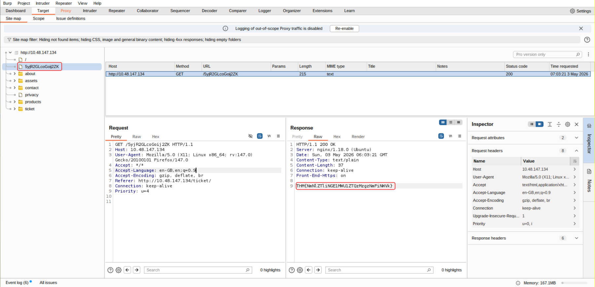
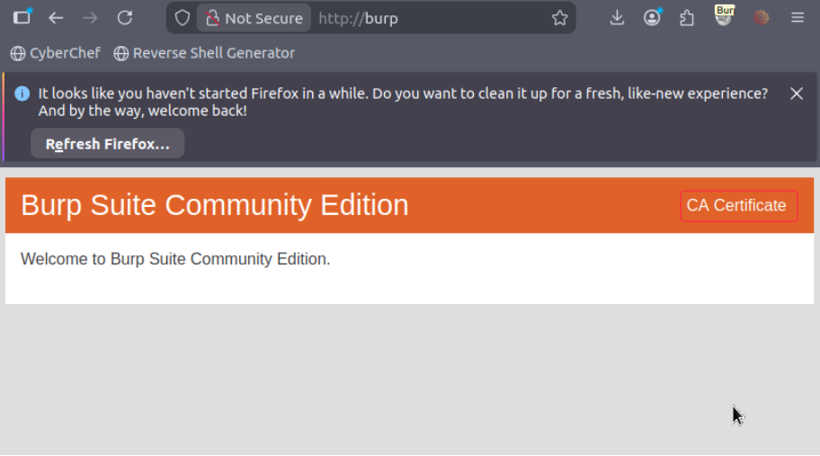
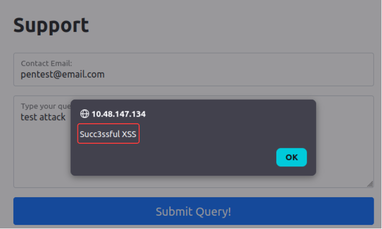

# Technical Learning Report: Burp Suite Basics

| Attribute            | Details                                        |
| :------------------- | :--------------------------------------------- |
| **Platform**         | TryHackMe                                      |
| **Course Path**      | Web Application Penetration Testing            |
| **Topic**            | Burp Suite: The Basics                         |

---

## Executive Summary
This report details the operational deployment and configuration of Burp Suite Community Edition. The analysis focuses on establishing a Man-in-the-Middle (MITM) position to intercept, analyze, and manipulate web traffic. Key outcomes include the successful decryption of HTTPS traffic, automated site mapping to discover hidden endpoints, and the execution of a reflected Cross-Site Scripting (XSS) attack by bypassing client-side validation.

**Core Objectives Identified:**
1.  **Traffic Interception:** Establishing a reliable proxy bridge between the browser and target server.
2.  **Attack Surface Mapping:** Using the Site Map to identify unlinked resources and directories.
3.  **Vulnerability Verification:** Demonstrating the ease of bypassing client-side security controls through direct request tampering.

---

## Technical Analysis

### 01. The Interception Bridge
The core of Burp Suite is its Proxy module. By routing browser traffic through a local listener (typically `127.0.0.1:8080`), we break the direct line of communication between the client and server. This allows for granular control over every HTTP request and response.

### 02. Scoping and Noise Reduction
In a professional assessment, project scoping is vital. It prevents the "HTTP History" from being cluttered with background traffic (such as OS updates or browser telemetry). By defining a target scope, we ensure that the Intercept engine only triggers for relevant domains.

### 03. The Fallacy of Client-Side Security
A primary takeaway of this lab is the demonstration that client-side filters (JavaScript validation) are not security boundaries. Since the user controls the browser environment, these filters can be entirely bypassed by modifying the request in Burp Suite after it has left the browser but before it reaches the server.

---

## Task Completion and Evidence

### Task 2: What is Burp Suite
*   **Question:** Which edition of Burp Suite runs on a server and provides constant scanning for target web apps?
*   **Answer:** Burp Suite Enterprise
*   **Question:** Burp Suite is frequently used when attacking web applications and ______ applications?
*   **Answer:** Mobile

### Task 3: Features of Burp Community
*   **Question:** Which Burp Suite feature allows us to intercept requests between ourselves and the target?
*   **Answer:** Proxy
*   **Question:** Which Burp tool would we use to brute-force a login form?
*   **Answer:** Intruder

### Task 5: The Dashboard
*   **Question:** What menu provides information about the actions performed by Burp Suite, such as starting the proxy, and details about connections made through Burp?
*   **Answer:** Event log

### Task 6: Navigation
*   **Question:** Which tab Ctrl + Shift + P will switch us to?
*   **Answer:** Proxy tab

### Task 7: Options
*   **Question:** In which category can you find a reference to a "Cookie jar"?
*   **Answer:** Sessions
*   **Question:** In which base category can you find the "Updates" sub-category, which controls the Burp Suite update behaviour?
*   **Answer:** Suite
*   **Question:** What is the name of the sub-category which allows you to change the keybindings for shortcuts in Burp Suite?
*   **Answer:** Hotkeys
*   **Question:** If we have uploaded Client-Side TLS certificates, can we override these on a per-project basis (yea/nay)?
*   **Answer:** yea

### Task 8 & 9: Proxy Configuration
**SOP: Establishing the Proxy Connection (Gateway Strike)**
1.  **Initialize Burp:** Launch a Temporary Project using default settings.
2.  **Verify Listener:** Ensure the Proxy listener is active on `127.0.0.1:8080`.
3.  **Configure FoxyProxy:** Select the Burp profile in Firefox to route traffic to the listener.
4.  **Action:** Toggle **Intercept is ON** in Burp and refresh the target page to capture the first request.

### Task 10: Site Map and Hidden Endpoints
**SOP: Mapping the Attack Surface (Architect Strike)**
1.  **Crawl:** Methodically visit every link on the homepage (Home, About, Contact).
2.  **Analyze:** Open the **Target > Site map** tab to view the generated tree structure.
3.  **Identify:** Locate endpoints that are not explicitly linked but appear in the directory listing.
*   **Question:** What is the flag you receive after visiting the unusual endpoint?
*   **Answer:** THM{NmNlZTliNGE1MWU1ZTQzMzgzNmFiNWVk}

### Task 12: Scoping and Targeting
**SOP: Establishing Scope (Silence Strike)**
1.  **Define:** Right-click the target domain in the Site Map and select **Add to scope**.
2.  **Filter:** In **Proxy Settings**, enable the rule: `And | URL | Is in target scope`.
3.  **Result:** Burp will now auto-forward all out-of-scope traffic, focusing only on the target.

### Task 13: Proxying HTTPS
**SOP: Decrypting HTTPS Traffic (Sovereign Strike)**
1.  **Download:** Visit `http://burp/cert` in a proxied browser to download the `cacert.der` file.
2.  **Import:** In Firefox Settings, import the certificate into the **Authorities** store.
3.  **Trust:** Check "Trust this CA to identify websites" to allow Burp to decrypt TLS traffic.

### Task 14: Example Attack (Reflected XSS)
**SOP: Bypassing Client-Side Validation (Surgical Strike)**
1.  **Intercept:** Enter valid data in the support form and click submit while **Intercept is ON**.
2.  **Tamper:** In the Burp Proxy window, replace the valid email with: ``.
3.  **Transcode:** Highlight the payload and press **Ctrl + U** to URL encode it.
4.  **Execute:** Click **Forward** to send the malicious payload to the server.

---

## Final Conclusion
Mastering Burp Suite Basics is the first step toward professional web penetration testing. By establishing a Man-in-the-Middle position, we gain visibility into the "hidden" logic of an application. This lab proves that structural reconnaissance via Site Mapping and manual manipulation of requests are essential for identifying vulnerabilities like XSS that client-side filters fail to prevent.

