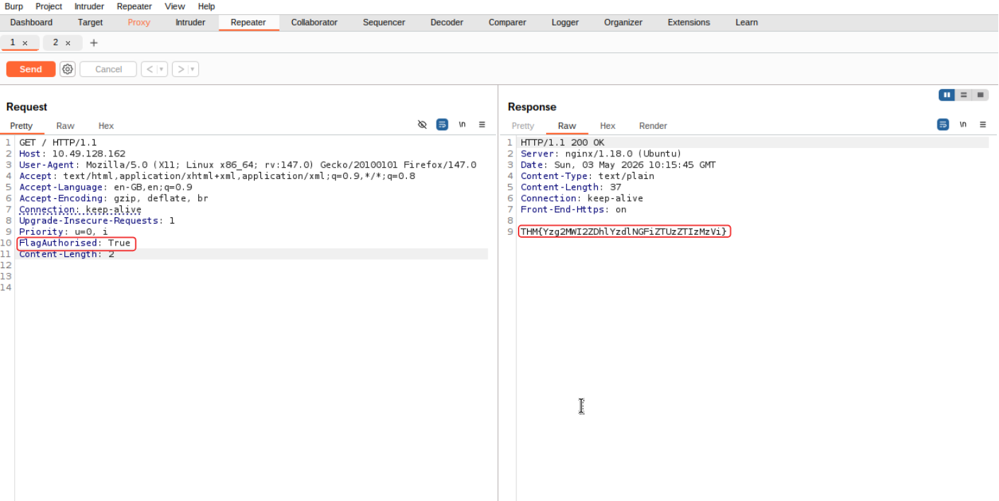
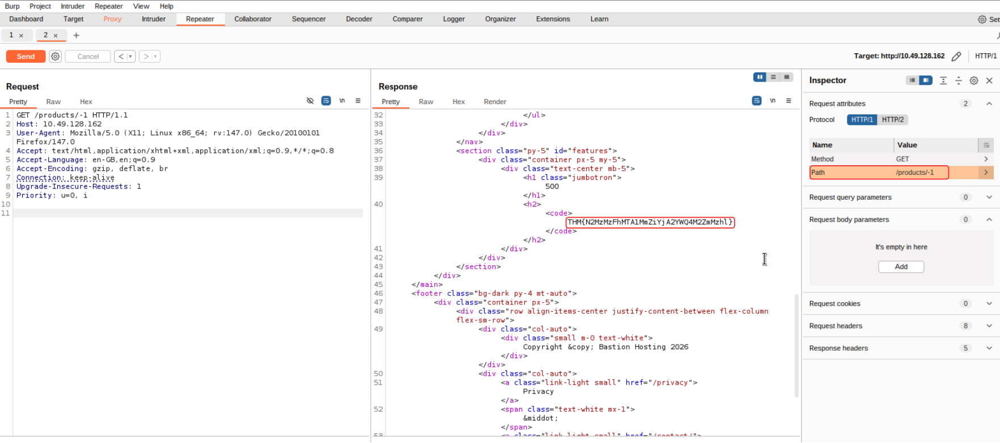
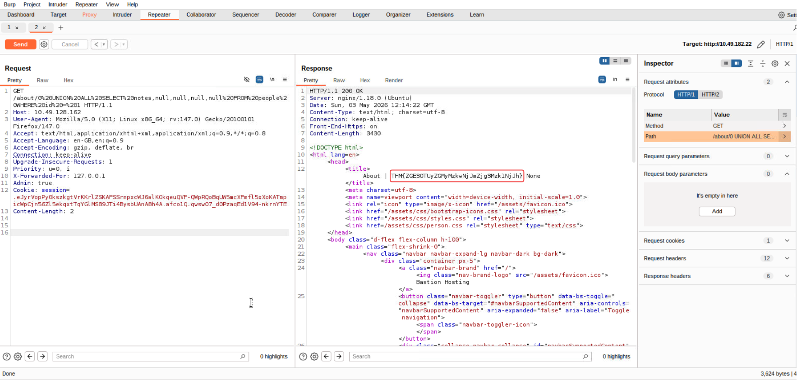

# Technical Learning Report: Burp Suite Repeater

| Attribute            | Details                                        |
| :------------------- | :--------------------------------------------- |
| **Platform**         | TryHackMe                                      |
| **Course Path**      | Web Application Penetration Testing            |
| **Topic**            | Burp Suite: Repeater                           |

---

## Executive Summary
This report documents the advanced utilization of Burp Suite Repeater for iterative request manipulation and database exploitation. The analysis demonstrates the transition from passive traffic observation to active resource enumeration and Union-based SQL Injection (SQLi). Key outcomes include the discovery of information leaks via verbose 500-series internal errors and the successful exfiltration of sensitive administrative notes from a backend database.

**Core Objectives Identified:**
1.  **Iterative Analysis:** Utilizing the Repeater module to modify and replay HTTP requests without browser interaction.
2.  **Logic Probing:** Testing server-side responses to invalid input through intentional error triggering.
3.  **Database Extraction:** Executing a multi-stage Union SQLi to map schema structure and retrieve unauthorized data.

---

## Technical Analysis

### 01. The Repeater Workflow
Repeater serves as a sandbox for manual HTTP tampering. Unlike the Proxy module, which intercepts live traffic, Repeater allows for the "replaying" of a captured request multiple times with incremental changes. This is essential for testing how a server handles varied parameters, headers, and HTTP methods in an isolated environment.

### 02. Inspector and Attribute Manipulation
The Inspector provides a visually organized breakdown of requests, allowing for non-destructive testing of headers and parameters. This reduces syntax errors often found in raw text editing. For example, modifying the "Path" attribute in the Inspector automatically updates the raw HTTP request line, ensuring protocol compliance.

### 03. Union-Based SQL Injection Logic
A Union SQLi leverages the `UNION` operator to combine the results of the original application query with a second, attacker-controlled query. This requires the number of columns to match perfectly. By analyzing verbose error messages that leak the original `SELECT` statement, an auditor can bypass the enumeration phase and move directly to data exfiltration.

---

## Task Completion and Evidence

### Task 2: What is Repeater?
*   **Question:** Which section gives us a more intuitive control over our requests?
*   **Answer:** Inspector

### Task 3: Basic Usage
*   **Question:** Which view will populate when sending a request from the Proxy module to Repeater?
*   **Answer:** Request

**SOP 1: Request Transfer and Baseline Replay**
1.  **Capture:** Locate the desired request in the **Proxy > HTTP history**.
2.  **Transfer:** Right-click the request and select **Send to Repeater** (or use the shortcut **Ctrl + R**).
3.  **Establish Baseline:** Switch to the Repeater tab and click **Send** to populate the initial Response view.

### Task 4 & 5: Message Analysis and Inspector
*   **Question:** Which option allows us to visualize the page as it would appear in a web browser?
*   **Answer:** Render
*   **Question:** Which section in Inspector is specific to POST requests?
*   **Answer:** Body Parameters

**SOP 2: Structured Attribute Modification**
1.  **Access Inspector:** Open the **Inspector** panel on the right side of the Repeater window.
2.  **Modify Attributes:** Expand the **Request Attributes** section to change the HTTP method (e.g., GET to POST) or the resource path.
3.  **Header Management:** Use the **Request Headers** section to add custom headers, such as "X-Forwarded-For," to test identity-based filters.

### Task 6: Practical Example (Header Tampering)
By adding a custom header (`FlagAuthorised: True`) to the request, the server’s identity-check was bypassed, resulting in the reflection of the hidden flag.

*   **Flag Captured:** `THM{Yzg2MWI2ZDhlYzdlNGFiZTUzZTIzMzVi}`

### Task 7: Challenge (Error-Based Reconnaissance)
The target endpoint `/products/ID` was fuzzed with an invalid numeric index (`-1`), causing a 500 Internal Server Error that exposed the challenge flag.

*   **Flag Captured:** `THM{N2MzMzFhMTA1MmZiYjA2YWQ4M2ZmMzhl}`

**SOP 3: Probing for Server-Side Exceptions**
1.  **Intercept:** Capture a request to a numeric endpoint (e.g., `/products/1`).
2.  **Inject:** In Repeater, change the integer to an extreme or invalid value (e.g., `-1`, `0`, or `999999`).
3.  **Analyze:** Send the request and review the response body and headers for debug information or leaked flags.

### Task 8: Extra-mile Challenge (Union SQL Injection)
The vulnerability in the `/about/ID` endpoint was exploited through a three-stage Union attack.
1.  **Break:** A single quote (`'`) was added to the ID to leak the query: `SELECT firstName, lastName, pfpLink, role, bio FROM people WHERE id = ...`.
2.  **Enumerate:** The query `0 UNION ALL SELECT group_concat(column_name),null,null,null,null FROM information_schema.columns WHERE table_name="people"` identified a `notes` column.
3.  **Extract:** The query `0 UNION ALL SELECT notes,null,null,null,null FROM people WHERE id = 1` retrieved the CEO's notes.

*   **Flag Captured:** `THM{ZGE3OTUyZGMyMzkwNjJmZjg3Mzk1NjJh}`

---

## Final Conclusion
Burp Suite Repeater is the primary tool for transitioning from discovery to exploitation. By utilizing verbose error messages and Union-based SQLi, this assessment demonstrated that internal application logic can be forced to reveal sensitive administrative data. Defensive remediation must prioritize the implementation of **Parameterized Queries** and the total suppression of technical error messages in production environments.

