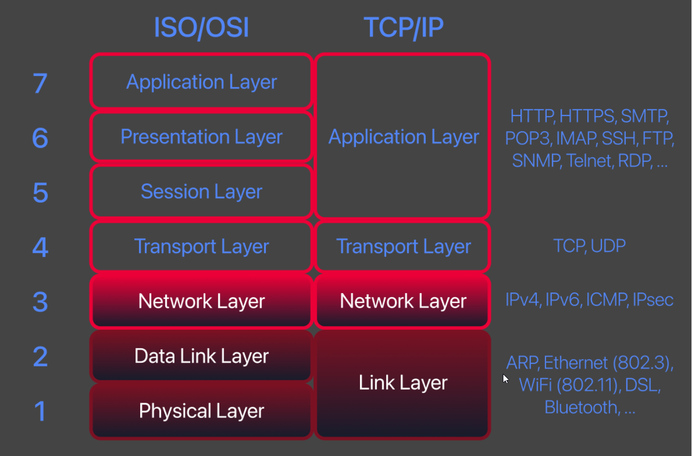
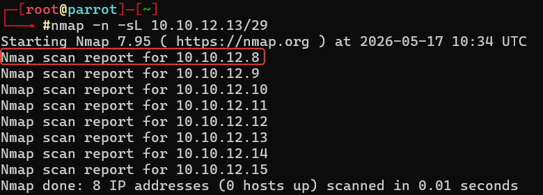

# Technical Learning Report: Nmap Live Host Discovery

| Attribute            | Details                                        |
| :------------------- | :--------------------------------------------- |
| **Platform**         | TryHackMe                                      |
| **Course Path**      | Nmap                                           |
| **Topic**            | Nmap Live Host Discovery                       |

---

## Executive Summary
This report deconstructs the logical methodology of host discovery using Nmap. The analysis focuses on how network reconnaissance scales across the OSI model, moving from physical Layer 2 (ARP) to transport Layer 4 (TCP/UDP). By understanding the reflexive nature of various protocols, an operator can identify active systems even when standard diagnostic tools like ICMP Echo are filtered by environmental firewalls.

**Core Objectives Identified:**
1.  **Segment Boundaries:** Identifying how routers act as a hard stop for Layer 2 broadcasts.
2.  **Protocol Interrogation:** Leveraging specific ICMP types and TCP flags to force a response from a target kernel.
3.  **Efficiency and Scope:** Pruning network noise by verifying host existence prior to deep port scanning.

---

## Technical Analysis

### 01. Layer 2 Discovery: The Local Link
On a local network segment, communication relies on the physical hardware address (MAC). Nmap utilizes the Address Resolution Protocol (ARP) as its primary discovery tool for local subnets.
*   **The Invariant:** A host cannot ignore an ARP request if it wishes to remain functional on the local segment.
*   **Limitation:** ARP packets are non-routable. They cannot cross a router's interface to reach a different subnetwork.

### 02. Layer 3 Discovery: Network Layer Probes (ICMP)
When targeting systems beyond the local router, Nmap pivots to the Internet Control Message Protocol (ICMP).
*   **ICMP Echo (-PE):** The standard "ping" request. Frequently blocked by modern firewalls (e.g., Windows Defender).
*   **ICMP Timestamp (-PP) and Address Mask (-PM):** Diagnostic probes that often bypass basic firewall rules that only target standard Echo requests.

### 03. Layer 4 Discovery: Transport Layer Probes (TCP/UDP)
Transport layer discovery functions by attempting to initiate or violate the protocol handshake.
*   **TCP SYN Ping (-PS):** Attempts to initiate a connection. A response of SYN/ACK or RST confirms the host is active.
*   **TCP ACK Ping (-PA):** Sends an unsolicited acknowledgement. The target kernel must respond with an RST to maintain the state machine, proving it is online.
*   **UDP Ping (-PU):** Hits a port with a UDP packet, expecting an "ICMP Port Unreachable" error. The host is confirmed up by its own error reporting.

---

## Task Completion and Evidence

### Task 2: Subnetworks and ARP Boundaries
Analysis of the network simulator confirms that ARP broadcasts are confined to the local subnetwork.
*   **Question:** How many devices can see the ARP Request (C1 to C6)? 
*   **Answer:** 4 (Computer 2, 3, and the Router).
*   **Question:** Did computer6 receive the ARP Request? 
*   **Answer:** nay (The router did not forward the broadcast).
*   **Question:** Did computer6 reply to the ARP Request (C4 to C6)? 
*   **Answer:** yea (Both reside in the same broadcast domain).

### Task 3: Host Discovery through TCP/IP Layers
Identifying the dependency of logical IP communication on physical MAC resolution.
*   **Question:** What type of packet did computer1 send before the ping? 
*   **Answer:** ARP Request.
*   **Question:** How many computers responded to the ping request? 
*   **Answer:** 1.
*   **Question:** What is the name of the first device that responded to the first ARP Request (Remote scan)?
*   **Answer:** router.

### Task 4: Enumerating Targets
Calculating scan scope based on CIDR notation and octet ranges.
*   **Question:** What is the first IP scanned for 10.10.12.13/29? 
*   **Answer:** 10.10.12.8.
*   **Question:** How many IP addresses in the range 10.10.0-255.101-125? 
*   **Answer:** 6400 (256 * 25).

### Task 5: ARP Host Discovery
*   **Question:** How many hosts are found alive after scanning the CONNECTION_IP/24? 
*   **Answer:** 1.
*   **Technical Insight:** ARP scans are faster and more reliable than ICMP on local segments because they are rarely filtered by host-based firewalls.

### Task 6: ICMP Host Discovery
*   **ICMP Timestamp Option:** -PP
*   **ICMP Address Mask Option:** -PM
*   **ICMP Echo Option:** -PE

### Task 7: TCP and UDP Host Discovery
*   **Unprivileged TCP Scan:** TCP SYN Ping.
*   **Privileged TCP Scan:** TCP ACK Ping.
*   **Telnet SYN Ping Syntax:** -PS23.

### Task 8: Using Reverse-DNS Lookup
Reverse DNS resolution allows the operator to map numerical IP addresses to functional hostnames, providing context to the infrastructure.
*   **Option to force rDNS for all possible hosts:** -R

---

## Final Conclusion
Mastery of Nmap host discovery requires a layered approach. Effective reconnaissance begins by identifying the network distance. Local targets are best interrogated via Layer 2 ARP, while remote or firewalled targets require a combination of Layer 3 diagnostic probes and Layer 4 protocol violations to ensure total visibility of the attack surface.