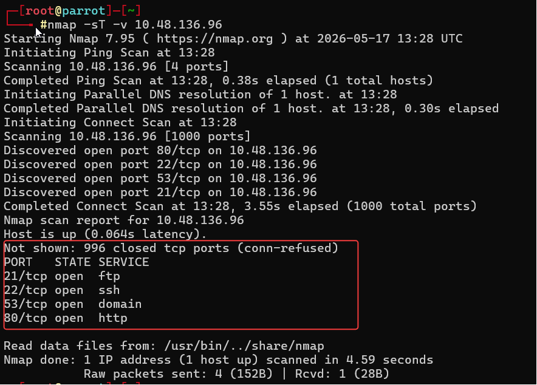
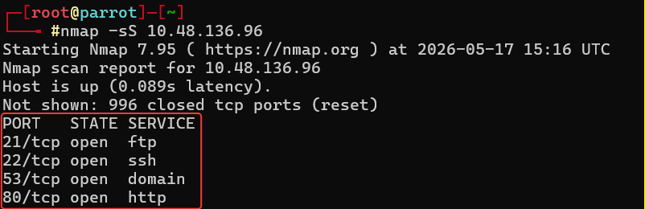
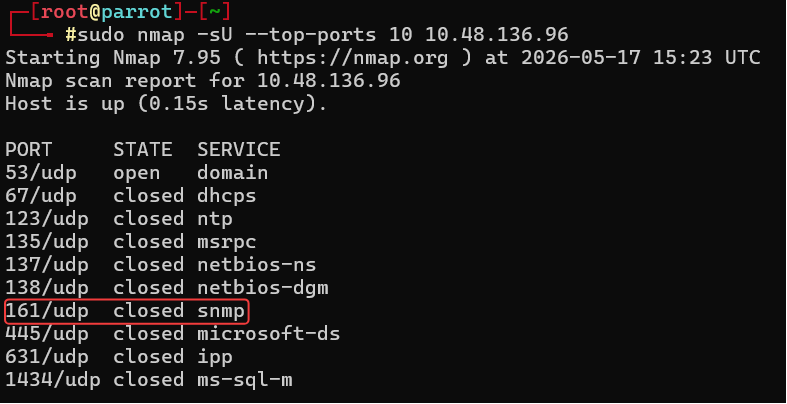

# Technical Learning Report: Nmap Basic Port Scans

| Attribute            | Details                                        |
| :------------------- | :--------------------------------------------- |
| **Platform**         | TryHackMe                                      |
| **Course Path**      | Nmap                                           |
| **Topic**            | Nmap Basic Port Scans                          |

---

## Executive Summary
This report deconstructs the fundamental mechanics of port discovery and state inference using Nmap. The analysis focuses on the interaction between the scanner and the target’s TCP/IP stack. By manipulating Transport Layer (Layer 4) flags and monitoring the resulting kernel-level reflexes, an operator can determine the accessibility and functional status of network services.

**Core Objectives Identified:**
1.  **State Categorization:** Defining the six logical states of a port (Open, Closed, Filtered, Unfiltered, and hybrid states).
2.  **Handshake Logic:** Analyzing the differences between a full TCP Connect scan and a "Half-Open" Stealth SYN scan.
3.  **Connectionless Probing:** Identifying the unique challenges of UDP discovery where silence is often ambiguous.
4.  **Temporal Optimization:** Tuning scan speed and parallelization to balance accuracy against detection risk.

---

## Technical Analysis

### 01. Logic of the Port State
A port's state is not a static property but an inference based on the response to a probe.
*   **Open:** The service is actively listening and has completed the handshake.
*   **Closed:** The target is reachable, but the kernel sends an **RST (Reset)** packet to indicate no service is listening.
*   **Filtered:** Nmap receives no response or an ICMP error, indicating a firewall is dropping the packets.
*   **Unfiltered:** Reachable via ACK scan, but the specific open/closed status is indeterminate.

### 02. TCP Handshake Mechanics and Flag Manipulation
Nmap's primary TCP scans rely on the manipulation of control flags (SYN, ACK, RST, FIN, PSH, URG) to elicit specific responses from the target's kernel.
*   **TCP Connect Scan (-sT):** Utilizes the operating system's `connect()` API to complete the full 3-way handshake. It is reliable but generates high log noise.
*   **TCP SYN Scan (-sS):** The "Stealth" approach. It sends a SYN, receives a SYN/ACK (confirming the port is open), and immediately sends an RST to tear down the connection before the application-layer log is triggered.

### 03. UDP Probing Challenges
Unlike TCP, UDP is connectionless and provides no handshake confirmation.
*   **The Invariant:** An open UDP port typically remains silent. A closed UDP port is only confirmed if the target kernel sends an **ICMP Type 3 Code 3 (Port Unreachable)** message.
*   **Ambiguity:** Silence in UDP can mean the port is open or that the probe was dropped by network congestion or a firewall.

---
## Task Completion and Evidence

### Task 1 & 4: Initial Scoping and TCP Connect Results
A baseline scan was performed to identify the primary attack surface of the target IP.
*   **Question:** What is the state of the FTP service running on port 21? 
*   **Answer:** open.
*   **Question:** What is Nmap’s guess about the service running on port 53? 
*   **Answer:** domain.

### Task 2: Port Definitions
*   **Question:** Which service uses UDP port 53 by default? 
*   **Answer:** DNS.
*   **Question:** Which service uses TCP port 22 by default?
*   **Answer:** SSH.
*   **Question:** How many port states does Nmap consider? 
*   **Answer:** 6.

### Task 3: TCP Flag Mechanics
*   **Question:** What 3 letters represent the Reset flag?
*   **Answer:** RST.
*   **Question:** Which flag needs to be set when you initiate a TCP connection? 
*   **Answer:** SYN.

### Task 5: Stealth SYN Probing
The SYN scan allows for high-speed discovery with a reduced forensic footprint.
*   **Question:** After launching a TCP SYN scan, how many SYN-ACK packets are successfully received?
*   **Answer:** 4.
*   **Question:** How many ports are open on the target machine? 
*   **Answer:** 4.

### Task 6: Connectionless UDP Discovery
The UDP scan targets the "Silent" surface of the network.
*   **Question:** What is the state of port 161 (SNMP) on the target? 
*   **Answer:** closed.

### Task 7: Performance Tuning
Optimizing Nmap involves managing the "Timing Template" and probe parallelization.
*   **Question:** Option to scan all TCP ports between 5000 and 5500? 
*   **Answer:** -p5000-5500.
*   **Question:** How to ensure Nmap runs at least 64 probes in parallel? 
*   **Answer:** --min-parallelism=64.
*   **Question:** Option to make Nmap very slow and paranoid? 
*   **Answer:** -T0.

---

## Final Conclusion
 Port scanning requires a deep understanding of protocol-level reflexes. A full TCP Connect scan provides the highest accuracy but the highest detection risk. Conversely, a SYN scan offers stealth by operating at the kernel level. by selecting the probe type that balances the need for visibility against the environmental security posture.